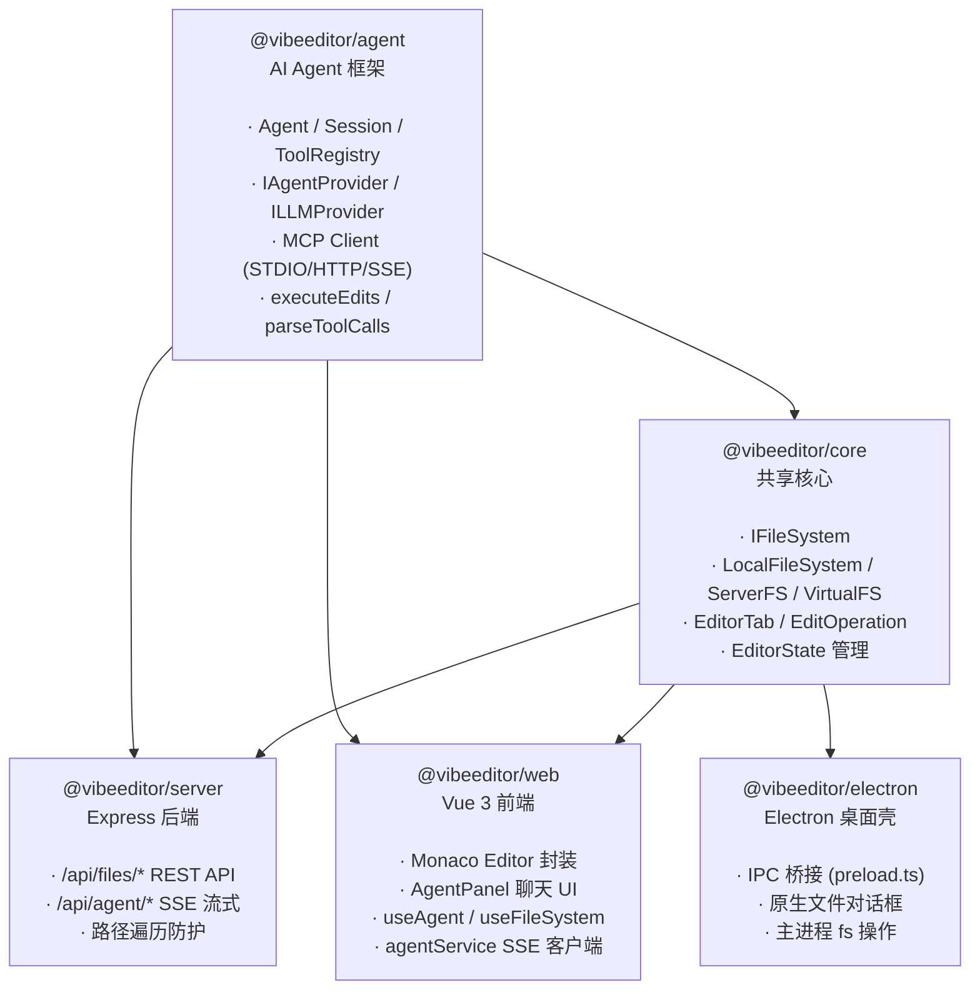
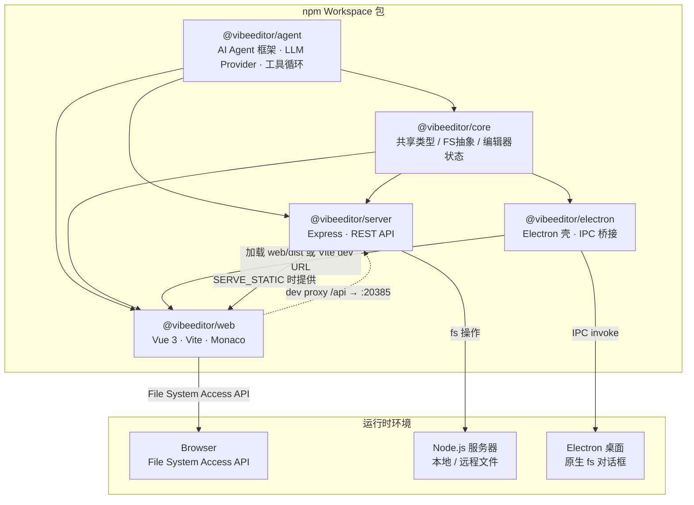
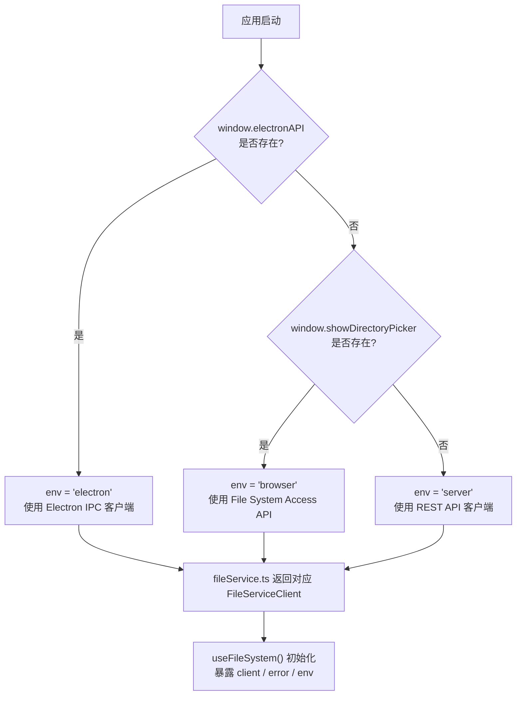
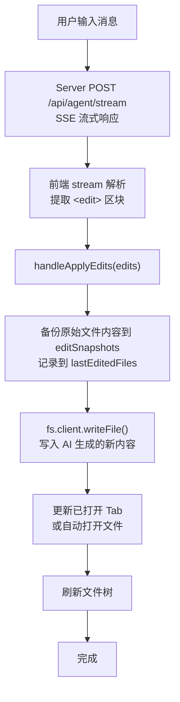
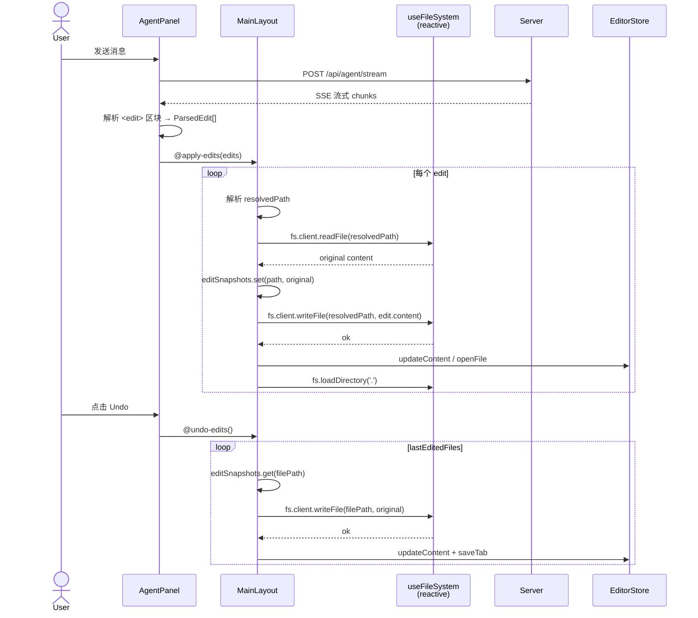

# VibeEditor

> [English](README_EN.md)

基于 **Monaco Editor** + **Vue 3** 的 AI 辅助代码编辑器，同时支持**服务器部署**和 **Electron 桌面端**。


## 功能需求与开发进度

> **图例**: ✅ 已完成 &nbsp; ⚠️ 框架就绪，待实现 &nbsp; ❌ 未开始

### P0 — 核心编辑

| # | 功能 | 状态 | 说明 |
|---|------|------|------|
| 1 | Monaco Editor 集成 | ✅ | 语法高亮、vs-dark 主题、Minimap、Bracket 配对 |
| 2 | 多 Tab 管理 / 脏标记 | ✅ | Pinia store 驱动, `packages/web/src/stores/editor.ts` |
| 3 | 打开文件 (本地/远程) | ✅ | Electron IPC + Server API 已通; 浏览器 File System Access API 仅框架 |
| 4 | 打开文件夹 (目录树) | ✅ | Electron `showOpenDialog` + Server `/api/files/list` 已通; 浏览器端未完成 |
| 5 | 文件保存 (Ctrl+S) | ✅ | Electron IPC + Server API 均已实现 |
| 6 | 新建无标题文件 | ✅ | `store.newUntitled()` |
| 7 | 键盘快捷键 | ⚠️ | 已绑定包含了复制（ctrl+c）、粘贴（ctrl+v）、剪切（ctrl+x）、撤销（ctrl+z）、恢复（ctrl+y）、查找（ctrl+f）、替换（ctrl+h）; Electron 菜单快捷键 IPC 桥接就绪但未接入; 缺少完整快捷键体系 |

### P1 — AI Agent 辅助编辑

| # | 功能 | 状态 | 说明 |
|---|------|------|------|
| 8 | Agent 对话面板 | ✅ | `AgentPanel.vue`, 支持 chat/edit/agent 三种模式、Markdown + KaTeX 渲染、多 Provider 配置管理 |
| 9 | Agent 消息流式输出 (SSE) | ✅ | Server SSE + 前端 stream 解析已完整打通; 支持真实 LLM 流式响应 |
| 10 | Agent 生成编辑操作并应用到文件 | ⚠️ | `<edit>` 区块解析 → 文件写入流程已打通; 服务端 `/api/agent/apply-edits` 端点已实现但前端未调用 `executor.ts`; 编辑/Agent 模式的 system prompt 在 `@vibeeditor/agent` 的 `provider.ts` 中被硬编码为 `chat` 模式 (Bug) |
| 11 | Agent 上下文构建 (打开文件+光标+选区) | ✅ | `@vibeeditor/agent` — `buildContextPrompt()` 已实现; 但前端 `useAgent.ts` 未填充 `openFiles`, `fileTree` 等上下文到请求中 |
| 12 | 编辑操作撤销/重做 | ⚠️ | `@vibeeditor/agent` — `revertEdits()` 已实现; 前端未接入 UI |
| 13 | LLM 后端对接 (OpenAI / Anthropic / etc.) | ⚠️ | 已通过 raw fetch 对接 OpenAI 兼容 API (支持 Ollama / vLLM 等); 无 SDK 依赖; 编辑/Agent 模式 system prompt 硬编码 bug (#10) 待修复 |

### P2 — 文件系统 & 项目管理

| # | 功能 | 状态 | 说明 |
|---|------|------|------|
| 14 | 三种文件系统实现 (`IFileSystem`) | ✅ | `LocalFileSystem` / `ServerFileSystem` / `VirtualFileSystem` |
| 15 | 运行时环境自动检测 | ✅ | `fileService.ts` → 检测 Electron / Server / Browser |
| 16 | 文件/文件夹重命名 | ✅ | 底层 API 已实现; 右键上下文菜单已集成 |
| 17 | 文件/文件夹删除 | ✅ | 底层 API 已实现; 右键上下文菜单已集成 |
| 18 | 新建文件/文件夹 | ✅️ | Server + Electron API 已实现; 新建文件/文件夹功能已集成至左上角File中 |
| 19 | 文件监听 / 自动刷新 | ⚠️ | `IFileSystem.watch()` 已定义, `LocalFileSystem` 实现了; Server 有 `chokidar` 依赖但未启用推送; 前端未消费 |
| 20 | 拖拽文件到编辑器打开 | ✅️ | |
| 21 | 最近打开的项目/文件列表 | ❌ | |
| 22 | 工作区持久化 (记住上次打开目录) | ❌ | Pinia store 纯内存, 刷新即丢失 (仅 LLM Provider 配置持久化到 localStorage) |

### P3 — 编辑增强

| # | 功能 | 状态 | 说明 |
|---|------|------|------|
| 23 | 搜索 / 替换 (单文件) | ✅ | 自定义 `SearchPanel.vue` 组件，支持 i18n、结果按文件分组、点击导航 |
| 24 | 跨文件搜索 (项目级) | ❌ | |
| 25 | Diff 对比视图 | ❌ | Monaco 内置 diff editor, 未封装 |
| 26 | 代码折叠 / 大纲 | ✅ | 由 Monaco 原生支持 |
| 27 | 多光标编辑 | ✅ | 由 Monaco 原生支持 |
| 28 | 语法错误 / 诊断信息 | ❌ | 需接入 TypeScript/ESLint Language Server |
| 29 | 代码自动补全 / IntelliSense | ⚠️ | Monaco 内置基础补全; TypeScript 语言的智能补全未配置 |
| 30 | 代码片段 (Snippets) | ❌ | |
| 31 | 格式化 (Prettier 集成) | ❌ | Prettier 已安装为 devDependency 但未被调用 |
| 32 | 主题切换 (亮色/暗色/自定义) | ✅ | 支持 dark/light/blue 三主题，持久化到 localStorage，Monaco 主题同步 |

### P4 — 部署 & 分发

| # | 功能 | 状态 | 说明 |
|---|------|------|------|
| 33 | 服务器部署 (Express + 静态前端) | ✅ | `SERVE_STATIC` 环境变量指向 `web/dist` |
| 34 | Electron 桌面应用 | ✅ | 支持 dev/prod 模式, IPC 文件操作, 文件对话框 |
| 35 | Electron 原生菜单栏 | ✅ | File/Edit/Help 菜单含快捷键，`main.ts` 和 `main-server.ts` 均已实现 |
| 36 | Electron 打包 / 安装程序 (electron-builder) | ⚠️ | `package.json` 已配置基本 `build` 字段 (appId, productName); 缺少平台目标 (win/mac/linux)、图标、自动更新等; 未验证 |
| 37 | 路径遍历防护 | ✅ | Server file routes 已做 `resolve` → `startsWith` 校验 |
| 38 | 认证 / 鉴权 (Bearer Token) | ⚠️ | 中间件已实现, 但 `index.ts` 中未被导入或挂载 (死代码) |
| 39 | Docker 部署 | ❌ | |
| 40 | CI/CD (GitHub Actions) | ❌ | |

### P5 — 体验 & 工程化

| # | 功能 | 状态 | 说明 |
|---|------|------|------|
| 41 | 自适应布局 (可拖拽分隔条) | ✅ | `MainLayout.vue` — 侧边栏宽度可调 |
| 42 | 状态栏 (光标位置、语言、编码) | ✅ | 自定义 `StatusBar.vue`，显示语言、实时行列位置、工作区模式 |
| 43 | 右键上下文菜单 | ✅ | 文件树右键菜单 (`@imengyu/vue3-context-menu`)，支持重命名/删除/新建/剪切/复制/粘贴/复制路径 |
| 44 | 错误/通知提示 (Toast) | ❌ | `useFileSystem.error` 有定义但未被任何 UI 渲染 |
| 45 | 加载状态 / 骨架屏 | ⚠️ | 文件树及 Agent 面板已有文本型 "Loading..." 提示; 无骨架屏/动画 |
| 46 | 国际化 (i18n) | ✅ | 中/英文通过 vue-i18n 实现，持久化到 localStorage，覆盖所有 UI 文本 |
| 47 | 响应式 / 移动端适配 | ❌ | 仅有 `<meta viewport>` 标签, 无 @media 查询 |
| 48 | 自动化测试 (unit / e2e) | ❌ | 无测试框架配置 |
| 49 | ESLint / Prettier 配置 | ❌ | 依赖已安装, 无配置文件 (lint 命令执行会失败) |
| 50 | 会话恢复 (重启后恢复 Tab) | ❌ | Pinia store 纯内存, 刷新即丢失 |

### 统计

| 状态 | 数量 |
|------|------|
| ✅ 已完成 | 27 |
| ⚠️ 框架就绪 | 9 |
| ❌ 未开始 | 14 |
| **合计** | **50** |

## 架构文档

### 1. 包依赖关系

> 箭头方向：`A --> B` 表示 B 依赖 A（A 是被依赖方）



**关键变化（相对旧架构）**：
- **新增** `@vibeeditor/agent` —— Agent 相关代码从 `core` 和 `server` 中抽离，形成独立的智能体模块，含 MCP 客户端
- **`@vibeeditor/core` 瘦身** —— 移除了 `agent/` 目录（types、context、executor），聚焦文件系统和编辑器状态
- **`@vibeeditor/server` 瘦身** —— 移除了 `agent/` 目录（provider、loop），改为依赖 `@vibeeditor/agent`
- **零外部依赖** —— `@vibeeditor/agent` 不依赖任何工作区包，通过 `IAgentFileSystem` 接口与平台解耦

### 2. 架构图 — 包依赖与部署拓扑



**说明**：`@vibeeditor/agent` 是独立的 AI Agent 框架模块，提供 LLM Provider、Agent 循环和工具执行等核心能力。`@vibeeditor/core` 聚焦文件系统抽象和编辑器状态管理。前端 `web` 在开发时通过 Vite proxy 将 `/api` 转发到 `server`；Electron 模式下前端由 Electron 窗口加载，文件操作通过 `preload.ts` 暴露的 IPC 桥接到主进程的 Node.js `fs`。

### 3. 流程图

#### 3.1 运行时环境检测与文件服务选择



**说明**：`detectEnvironment()` 在 `fileService.ts:22` 中一次性检测并缓存运行时环境，后续所有文件操作通过统一的 `FileServiceClient` 接口执行，上层组件不感知底层差异。

#### 3.2 Agent 编辑操作流程



**说明**：Agent 的每一次编辑操作在写入磁盘前都会自动备份原文件内容，使得用户可以通过 `undoLastEdits()` 一键回退所有修改。

### 4. 时序图 — Agent 编辑 & 撤销



**说明**：`handleApplyEdits` 在每次写入前先读取原文做快照；`undoLastEdits` 遍历 `lastEditedFiles` 逐一恢复。`fs` 由 `reactive(useFileSystem())` 创建，Vue 3 的 `reactive()` 自动解包嵌套 `ref`，因此访问时直接使用 `fs.client` 而非 `fs.client.value`。

### 5. 核心类型概览

**文件系统抽象层：**

| 接口/类 | 所在包 | 说明 |
|----------|--------|------|
| `IAgentFileSystem` | `@vibeeditor/agent` | 最小化文件系统接口（readFile / writeFile / exists / readDir） |
| `IFileSystem` | `@vibeeditor/core` | 完整文件系统接口（含 deleteFile / createDir / rename / stat / watch / dispose） |
| `LocalFileSystem` | `@vibeeditor/core` | Node.js `fs/promises` 实现 |
| `ServerFileSystem` | `@vibeeditor/core` | REST API 客户端实现 |
| `VirtualFileSystem` | `@vibeeditor/core` | 内存 Map 实现 |

**Agent / AI 层：**

| 接口/类 | 所在包 | 说明 |
|----------|--------|------|
| `IAgentProvider` | `@vibeeditor/agent` | 高层 Agent Provider 接口（initialize / sendMessage / streamMessage） |
| `ILLMProvider` | `@vibeeditor/agent` | 底层 LLM 调用接口（chat / chatStream） |
| `Agent` | `@vibeeditor/agent` | 多轮工具调用循环，自动注册 5 个默认工具 |
| `Session` | `@vibeeditor/agent` | 主 Agent + 子 Agent 编排，`<delegate>` 路由 |
| `ToolRegistry` | `@vibeeditor/agent` | 工具注册表，生成系统提示 |
| `ITool` | `@vibeeditor/agent` | 工具接口（name / description / usage / inputSchema / execute） |
| `McpManager` | `@vibeeditor/agent` | 多 MCP 服务器连接管理，工具发现与路由 |

**编辑器状态：**

| 接口/类 | 所在包 | 说明 |
|----------|--------|------|
| `EditorTab` | `@vibeeditor/core` | 标签页（id / name / path / content / language / isDirty） |
| `EditOperation` | `@vibeeditor/agent` | 编辑操作（oldText / newText / filePath） |
| `AgentContext` | `@vibeeditor/agent` | Agent 上下文（openFiles / fileTree / cursorPosition / selection / conversationHistory） |
| `EditorStore` | `@vibeeditor/web` | Pinia store —— 前端唯一状态源（tabs / fileTree / workspaceRoot） |

## 快速开始

```bash
# 安装依赖
npm install

# 同时启动服务器和前端（自动构建 @vibeeditor/agent + @vibeeditor/core）
npm run dev:all

# 或分别启动（均会自动构建 @vibeeditor/agent + @vibeeditor/core）
npm run dev:server   # 后端运行在 http://localhost:20385
npm run dev:web      # 前端运行在 http://localhost:5173
npm run dev:electron # Electron 桌面端（自动启动 Vite 前端 + Electron 窗口）

# CLI 和 MCP 测试
npm run cli          # 交互式 Agent CLI（支持 MCP 工具）
npm run mcp:test     # MCP 集成测试（STDIO / HTTP / SSE）
```

## 部署模式

| 模式 | 文件系统 | 启动命令 |
|------|---------|---------|
| **Electron** 桌面端 | 本地 FS, 通过 IPC (`Node.js fs`) | `npm run dev:electron`（自动启动 Vite + Electron，自动构建 agent、core 和 electron）<br/>两个入口：`main.ts`（标准窗口）和 `main-server.ts`（嵌入式服务器 + 原生菜单 + 无边框窗口） |
| **Server** 部署 (远程文件) | Server FS, 通过 REST API | `npm run dev:server` + `npm run dev:web` |
| **Browser** 本地文件 | File System Access API | `npm run dev:web` |

前端会在运行时自动检测环境, 在 `packages/web/src/services/fileService.ts` 中选择合适的文件服务。

## 构建

```bash
npm run build:agent     # 构建 AI Agent 框架
npm run build:core      # 构建共享核心
npm run build:server    # 构建 Express 后端
npm run build:web       # 构建 Vue 前端 (输出到 packages/web/dist/)
npm run build:electron  # 构建 Electron 主进程
npm run build:all       # 构建所有包 (agent → core → web → server → electron)
```

## 服务端 API

| 方法 | 端点 | 说明 |
|------|------|------|
| GET | `/api/files/list?path=&root=` | 列出目录内容 |
| GET | `/api/files/read?path=&root=` | 读取文件内容 |
| GET | `/api/files/read-buffer?path=&root=` | 读取文件为 base64（二进制文件） |
| POST | `/api/files/write` | 写入文件 `{ path, content, root }` |
| DELETE | `/api/files/delete?path=&root=` | 删除文件 |
| POST | `/api/files/mkdir` | 创建目录 `{ path, root }` |
| DELETE | `/api/files/rmdir?path=&root=` | 删除目录 |
| GET | `/api/files/exists?path=&root=` | 检查路径是否存在 |
| GET | `/api/files/stat?path=&root=` | 获取文件/目录元数据 |
| POST | `/api/files/rename` | 重命名 `{ oldPath, newPath, root }` |
| POST | `/api/agent/chat` | 发送消息给 Agent |
| POST | `/api/agent/stream` | 流式返回 Agent 响应 (SSE) |
| POST | `/api/agent/apply-edits` | 应用 AI 生成的编辑操作到文件 |
| POST | `/api/mcp/test` | 测试 MCP 服务器连接 `{ config }` |
| GET | `/api/config/:filename` | 读取配置文件 |
| PUT | `/api/config/:filename` | 写入配置文件 |
| GET | `/api/health` | 健康检查 |

## MCP (Model Context Protocol) 支持

VibeEditor 内置完整的 MCP 客户端，支持通过标准协议接入外部工具。

**传输模式：**

| 模式 | 使用场景 |
|------|----------|
| **STDIO** | 本地 MCP 服务器（子进程启动） |
| **HTTP** | 远程 MCP 服务器（HTTP POST，无状态） |
| **SSE** | 远程 MCP 服务器（Server-Sent Events，自动提取 `Mcp-Session-Id`） |

**核心类：**
- `McpManager` — 多服务器生命周期管理：连接、发现工具、自动路由调用
- `MCPClient` — 单服务器连接（initialize → `tools/list` → `tools/call`）
- `MCPToolAdapter` — 将 MCP `tools/call` 桥接为 `ITool` 接口，含参数类型自动转换
- `ToolCatalog` — 只读扁平工具元数据存储，用于展示/CLI 输出

**使用示例（多服务器）：**
```ts
const manager = new McpManager();
await manager.connectAll({
  mcpServers: {
    filesystem: { type: 'stdio', command: 'npx', args: ['-y', '@anthropic/mcp-server-filesystem'] },
    remote: { type: 'sse', url: 'https://example.com/mcp', headers: { Authorization: 'Bearer xxx' } },
  },
});
const tools = await manager.discoverAndCreateAdapters();
tools.forEach(t => agent.registerTool(t));
```

**集成点：**
- Server SSE 端点（`routes/agent.ts`）从请求体读取 `mcpConfig`，连接服务器并将工具注册到 Agent
- CLI（`cli.ts`）支持交互式 MCP 工具调用
- 前端 `McpSettingsPanel.vue` 管理 MCP 服务器配置
- `npm run mcp:test` 运行跨三种传输模式的集成测试

## 环境变量

| 变量 | 使用者 | 说明 | 默认值 |
|------|--------|------|--------|
| `LLM_API_URL` | `openai-client.ts` | LLM Provider API 地址 | `https://api.openai.com/v1` |
| `LLM_API_KEY` | `openai-client.ts` | LLM Provider API 密钥 | (空) |
| `LLM_MODEL` | `openai-client.ts` | LLM 模型名称 | `gpt-4o` |
| `SERVER_PORT` / `PORT` | `server/run.ts`, `electron/main-server.ts` | 服务端口 | `20385`（`app-config.json`） |
| `SERVE_STATIC` | `server/run.ts` | 静态前端文件路径（生产模式） | (空) |
| `VITE_DEV_SERVER_URL` | `electron/main.ts`, `electron/main-server.ts` | Vite 开发服务器 URL | `http://localhost:5173` |
| `AUTH_TOKEN` | `middleware/auth.ts` | Bearer Token（中间件未挂载） | (空) |
| `ELECTRON_MIRROR` | npm install | Electron 二进制下载镜像（国内使用） | (空) |

配置优先级：显式传入参数 > 环境变量 > 默认值

## 项目结构

### `@vibeeditor/agent`
- `types/agent.ts` — `AgentConfig`, `AgentContext`, `AgentDefinition`, `AgentMode`, `AgentResult`, `SessionMessage`
- `types/edit.ts` — `EditOperation`, `EditResult`
- `types/filesystem.ts` — `IAgentFileSystem`（最小化接口：readFile / writeFile / exists / readDir）
- `types/message.ts` — `AgentMessage`
- `types/provider.ts` — `IAgentProvider`（高层接口）、`ILLMProvider`（底层 LLM 调用接口）
- `types/tool.ts` — `ITool`, `ToolInputSchema`, `ToolExecutionContext`, `ToolAnnotations`
- `agent.ts` — `Agent` 类：多轮工具调用循环，自动注册 5 个默认工具
- `session.ts` — `Session` 类：主 Agent + 子 Agent 编排，`<delegate>` 标签路由
- `tool-registry.ts` — `ToolRegistry`：工具注册/查找/系统提示生成
- `tools/read-file.ts` — `ReadFileTool`（`<read_file>`）
- `tools/list-dir.ts` — `ListDirTool`（`<list_dir>`）
- `tools/search-code.ts` — `SearchCodeTool`（`<search_code>`）
- `tools/bash.ts` — `BashTool`（`<bash>`）—— 执行 shell 命令
- `tools/delegate.ts` — `DelegateTool`（`<delegate>`）
- `tools/index.ts` — `createDefaultTools()` 工厂函数（5 个工具）
- `mcp/manager.ts` — `McpManager`：多服务器生命周期管理、传输工厂、工具路由
- `mcp/client.ts` — `MCPClient`：单服务器连接（initialize / listTools / callTool）
- `mcp/adapter.ts` — `MCPToolAdapter`：将 MCP `tools/call` 桥接为 `ITool` 接口
- `mcp/config.ts` — `McpConfig` / `McpServerConfig` 类型定义
- `mcp/tool-catalog.ts` — `ToolCatalog`：只读扁平工具元数据存储
- `mcp/utils.ts` — `formatMCPResult`、`buildXMLUsage` 辅助函数
- `mcp/__test.ts` — MCP 集成测试（STDIO / HTTP / SSE 三种传输模式）
- `provider.ts` — `OpenAILikeProvider`（实现 `IAgentProvider`，原生 fetch，无 SDK 依赖）
- `openai-client.ts` — `createOpenAILLMProvider()` 工厂（实现 `ILLMProvider`）、`resolveLLMConfig()`、`buildMessages()`
- `loop.ts` — `AgentLoop`（@deprecated，请使用 `Agent` + `Session`）
- `parser.ts` — `parseToolCalls()`：基于正则的 XML 标签提取
- `executor.ts` — `executeEdits()` / `revertEdits()`：AI 文件编辑应用与回滚
- `context.ts` — `buildContextPrompt()`、`createEmptyContext()`、`getConversationSummary()`
- `cli.ts` — 交互式 CLI Agent，支持 MCP 工具
- `index.ts` — 统一导出所有公共 API

### `@vibeeditor/core`
- `fs/types.ts` — `IFileSystem` 接口, `FileEntry`, `FileContent`
- `fs/local.ts` — `LocalFileSystem` (Node.js fs)
- `fs/server.ts` — `ServerFileSystem` (REST 客户端)
- `fs/virtual.ts` — `VirtualFileSystem` (内存文件系统)
- `editor/types.ts` — `EditorTab`, `EditOperation`, 语言检测
- `editor/document.ts` — Tab/文档状态管理

### `@vibeeditor/web`
- `components/editor/MonacoEditor.vue` — Monaco 编辑器封装（主题感知）
- `components/editor/ImageViewer.vue` — PNG / JPG / GIF / SVG / WebP 图片查看
- `components/editor/PdfViewer.vue` — PDF 渲染
- `components/editor/DocxViewer.vue` — Word 文档查看
- `components/editor/ExcelViewer.vue` — Excel 表格查看
- `components/editor/PptxViewer.vue` — PowerPoint 幻灯片查看
- `components/editor/MarkdownViewer.vue` — Markdown 渲染（含 KaTeX 数学公式）
- `components/editor/HtmlViewer.vue` — HTML 实时预览
- `components/agent/AgentPanel.vue` — AI 对话面板（消息、流式输出、工具状态）
- `components/agent/ModeSelector.vue` — build / plan 模式切换
- `components/agent/ProviderSelect.vue` — LLM Provider 选择下拉框
- `components/agent/SettingsDialog.vue` — Provider 配置（API URL、密钥、模型）
- `components/file-tree/FileTree.vue` — 目录树组件
- `components/file-tree/TreeNode.vue` — 递归树节点
- `components/file-tree/contextMenu.ts` — 右键菜单构建（打开/重命名/删除/新建/剪切/复制/粘贴/复制路径）
- `components/layout/MainLayout.vue` — 可拖拽分隔布局
- `components/layout/ActivityBar.vue` — 左侧图标栏
- `components/layout/SideBar.vue` — 侧边面板容器
- `components/layout/RightToolbar.vue` — 右侧工具栏（Agent / MCP 切换）
- `components/layout/AboutDialog.vue` — 关于对话框
- `components/mcp/McpSettingsPanel.vue` — MCP 服务器列表管理
- `components/mcp/McpServerItem.vue` — MCP 服务器行（名称、类型、开关、操作）
- `components/mcp/McpEditDialog.vue` — 添加/编辑 MCP 服务器对话框
- `components/mcp/McpToolList.vue` — 工具列表展示
- `components/settings/SettingDropdown.vue` — 主题/语言切换弹出框
- `components/toolbar/Toolbar.vue` — 顶部工具栏
- `components/SearchPanel.vue` — 搜索面板（i18n 支持，结果按文件分组）
- `components/SaveDialog.vue` — 保存确认对话框
- `components/StatusBar.vue` — 底部状态栏（语言、行列位置、工作区模式）
- `composables/useAgent.ts` — Agent 状态管理、流式输出、上下文组装
- `composables/useFileSystem.ts` — 文件操作 + 键盘快捷键
- `composables/useEditor.ts` — Monaco 实例管理、文件打开
- `composables/useProviderSettings.ts` — LLM Provider 配置持久化
- `composables/useMcpSettings.ts` — MCP 服务器列表持久化
- `composables/useFileClipboard.ts` — 文件剪切/复制/粘贴操作
- `composables/useFileTreeContextMenu.ts` — 右键上下文菜单集成
- `composables/useWindowResize.ts` — 无边框窗口拖拽调整
- `services/agentService.ts` — Agent REST / SSE 客户端
- `services/fileService.ts` — 运行时检测 + 三模式文件操作
- `services/configService.ts` — 配置 CRUD（Electron IPC / REST / localStorage）
- `services/mcpService.ts` — MCP 服务器连接测试
- `services/editParser.ts` — 重新导出 `parseEditsFromText`
- `services/editorInstance.ts` — Monaco 编辑器单例持有
- `services/markdown.ts` — Markdown 渲染（含 KaTeX）
- `stores/editor.ts` — Pinia：标签页、文件树、工作区
- `stores/settings.ts` — Pinia：语言 + 主题（dark / light / blue）
- `stores/sessions.ts` — Pinia：多会话 Agent 聊天管理
- `locales/en.ts` — 英文翻译
- `locales/zh.ts` — 中文翻译
- `locales/index.ts` — vue-i18n 初始化

### `@vibeeditor/server`
- `routes/files.ts` — 文件 CRUD API（list / read / read-buffer / write / delete / mkdir / rmdir / exists / stat / rename），含路径遍历防护
- `routes/agent.ts` — Agent 对话 + SSE 流式端点（build 模式下集成 MCP）
- `routes/mcp.ts` — `POST /test` MCP 服务器连接测试
- `routes/config.ts` — `GET/PUT /:filename` 配置文件管理
- `middleware/auth.ts` — Bearer Token 认证中间件（默认未挂载）
- `index.ts` — Express 应用工厂 + `startServer()`
- `run.ts` — CLI 入口（读取 app-config.json，启动服务器）

### `@vibeeditor/electron`
- `main.ts` — 标准 Electron 入口：创建 `BrowserWindow`，加载 Vite dev URL 或 `web/dist/index.html`，原生菜单栏
- `main-server.ts` — 嵌入式 Express 服务器入口：原生菜单栏、无边框窗口、`vibe://` 协议、单实例锁
- `preload.ts` — Context Bridge 暴露 `window.electronAPI`（23 个 IPC 通道）
- `ipc/file-handler.ts` — 原生文件对话框和文件系统操作

---

> 贡献者指南详见 [CLAUDE.md](CLAUDE.md) —— 包含完整的脚本参考、架构设计、组件数据流和开发约定。