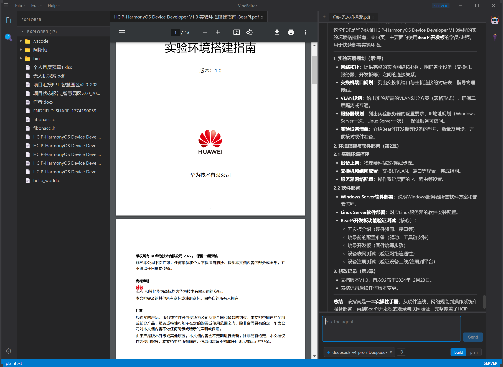
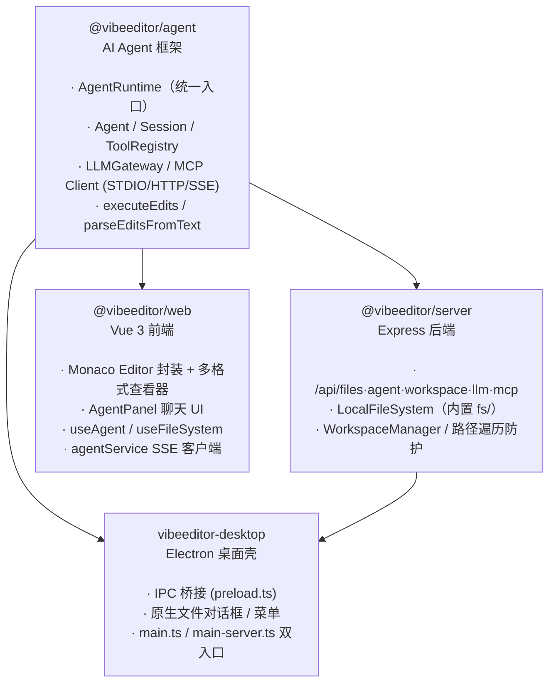
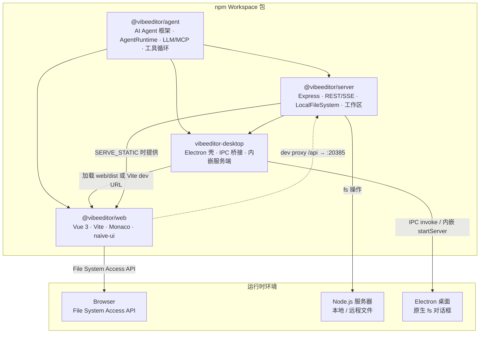
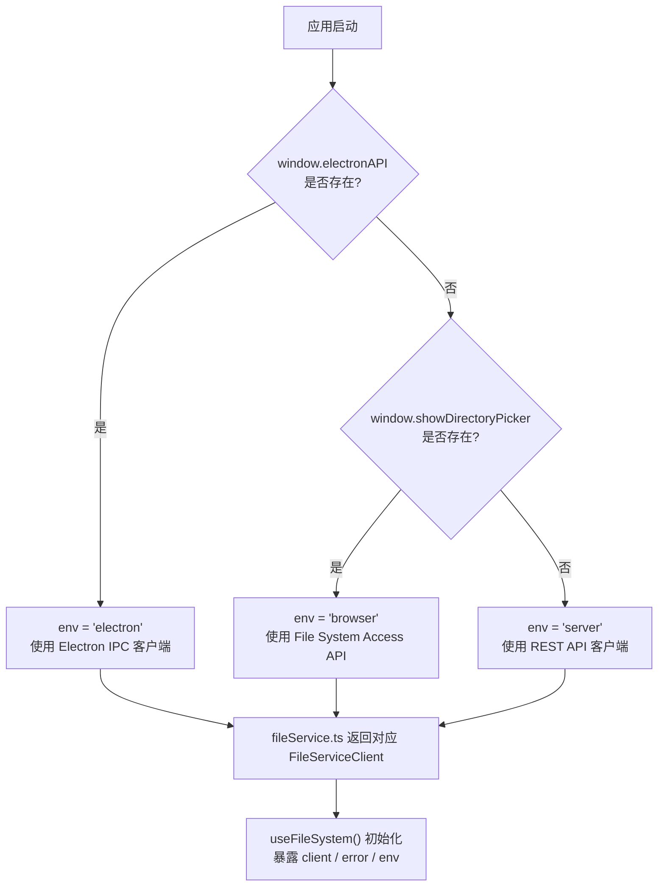
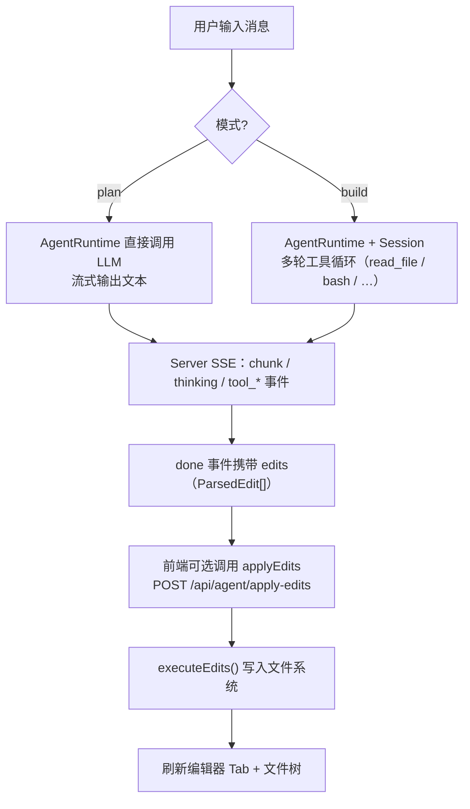
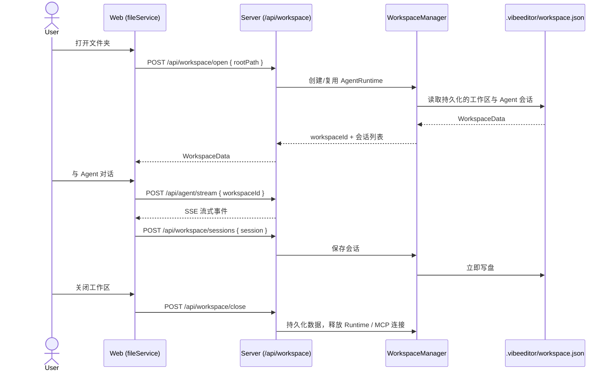

# VibeEditor

> [English](README_EN.md)

基于 **Monaco Editor** + **Vue 3** 的 AI 辅助代码编辑器，同时支持**服务器部署**和 **Electron 桌面端**。



## 快速开始 · 构建与部署

### 安装

```bash
npm install
```

### 开发

开发模式只有**两种**：

| 模式 | 命令 | 说明 |
|------|------|------|
| **Server（前后端分离）** | `npm run dev:all` | 同时启动 Express 后端（`http://localhost:20385`）与 Vite 前端（`http://localhost:5173`），二者通过 `/api` 代理通信；适用于浏览器 / 远程部署场景 |
| **Electron 桌面端** | `npm run dev:electron` | 自动启动 Vite 前端 + Electron 窗口；本地文件通过主进程 IPC 读写（`main.ts` 入口） |

> 两条命令都会先自动构建 `@vibeeditor/agent`。

如果只想**单独测试 Agent 模块**（不启动编辑器界面），可使用交互式 CLI：

```bash
npm run cli          # 交互式 Agent CLI（支持 MCP 工具）

# 传入待测试的模型信息（命令行参数 > 环境变量 LLM_API_URL/LLM_MODEL/LLM_API_KEY > 内置默认值）
npm run cli -- --url https://api.deepseek.com/v1 --model deepseek-v4-flash --key sk-xxxx
```

> CLI 不再内置硬编码的 API Key，需通过 `--key` 或环境变量 `LLM_API_KEY` 提供。模型信息最终通过 `AgentRuntime` 进行调用。

### 构建

```bash
npm run build:all       # 构建所有包（agent → web → server → electron）

# 或单独构建
npm run build:agent     # AI Agent 框架
npm run build:server    # Express 后端
npm run build:web       # Vue 前端（输出到 packages/web/dist/）
npm run build:electron  # Electron 主进程
```

### 部署

| 目标 | 命令 | 说明 |
|------|------|------|
| **Server 部署** | `npm run build:all` + `SERVE_STATIC` | 构建后设置环境变量 `SERVE_STATIC` 指向 `packages/web/dist` 启动服务端，由 Express 同时托管前端与 API |
| **Electron 免安装目录** | `npm run pack:electron` | electron-builder `--dir` 模式：仅产出解包后的应用目录，**不生成安装程序**，用于本地验证打包结果 |
| **Electron 安装程序** | `npm run dist:electron` | electron-builder 完整打包：生成可分发的 **Windows NSIS 安装程序** |

> Electron 有两个主进程入口：`main.ts`（标准窗口，IPC 文件操作）与 `main-server.ts`（内嵌 Express 服务端），详见 [packages/electron/README.md](packages/electron/README.md)。前端会在运行时自动检测环境（Electron / Server / Browser），在 `packages/web/src/services/fileService.ts` 中选择合适的文件服务。

## 功能需求与开发进度

> **图例**: ✅ 已完成 &nbsp; ⚠️ 框架就绪，待实现 &nbsp; ❌ 未开始

### P0 — 核心编辑

| # | 功能 | 状态 | 说明 |
|---|------|------|------|
| 1 | Monaco Editor 集成 | ✅ | 语法高亮、vs-dark 主题、Minimap、Bracket 配对 |
| 2 | 多 Tab 管理 / 脏标记 | ✅ | Pinia store 驱动, `packages/web/src/stores/editor.ts` |
| 3 | 打开文件 (本地/远程) | ✅ | Electron IPC + Server API 已通; 浏览器 File System Access API 仅框架 |
| 4 | 打开文件夹 (目录树) | ✅ | Electron `showOpenDialog` + Server `/api/files/list` 已通; 浏览器端未完成 |
| 5 | 文件保存 (Ctrl+S) | ✅ | Electron IPC + Server API 均已实现 |
| 6 | 新建无标题文件 | ✅ | `store.newUntitled()` |
| 7 | 键盘快捷键 | ⚠️ | 已绑定包含了复制（ctrl+c）、粘贴（ctrl+v）、剪切（ctrl+x）、撤销（ctrl+z）、恢复（ctrl+y）、查找（ctrl+f）、替换（ctrl+h）; Electron 菜单快捷键 IPC 桥接就绪但未接入; 缺少完整快捷键体系 |

### P1 — AI Agent 辅助编辑

| # | 功能 | 状态 | 说明 |
|---|------|------|------|
| 8 | Agent 对话面板 | ✅ | `AgentPanel.vue`, 支持 chat/edit/agent 三种模式、Markdown + KaTeX 渲染、多 Provider 配置管理 |
| 9 | Agent 消息流式输出 (SSE) | ✅ | Server SSE + 前端 stream 解析已完整打通; 支持真实 LLM 流式响应 |
| 10 | Agent 生成编辑操作并应用到文件 | ⚠️ | `<edit>` 区块解析 → 文件写入流程已打通; 服务端 `/api/agent/apply-edits` 端点已实现但前端未调用 `executor.ts`; 编辑/Agent 模式的 system prompt 在 `@vibeeditor/agent` 中被硬编码为 `chat` 模式 (Bug) |
| 11 | Agent 上下文构建 (打开文件+光标+选区) | ✅ | `@vibeeditor/agent` — 上下文已在 Agent 消息构造内联组装; 但前端 `useAgent.ts` 未填充 `openFiles`, `fileTree` 等上下文到请求中 |
| 12 | 编辑操作撤销/重做 | ⚠️ | `@vibeeditor/agent` — `revertEdits()` 已实现; 前端未接入 UI |
| 13 | LLM 后端对接 (OpenAI / Anthropic / etc.) | ⚠️ | 已通过 raw fetch 对接 OpenAI 兼容 API (支持 Ollama / vLLM 等); 无 SDK 依赖; 编辑/Agent 模式 system prompt 硬编码 bug (#10) 待修复 |

### P2 — 文件系统 & 项目管理

| # | 功能 | 状态 | 说明 |
|---|------|------|------|
| 14 | 三种文件系统实现 | ✅ | `LocalFileSystem`（server `fs/`）+ 浏览器 FSA 客户端 + REST 客户端（web `fileService.ts`） |
| 15 | 运行时环境自动检测 | ✅ | `fileService.ts` → 检测 Electron / Server / Browser |
| 16 | 文件/文件夹重命名 | ✅ | 底层 API 已实现; 右键上下文菜单已集成 |
| 17 | 文件/文件夹删除 | ✅ | 底层 API 已实现; 右键上下文菜单已集成 |
| 18 | 新建文件/文件夹 | ✅️ | Server + Electron API 已实现; 新建文件/文件夹功能已集成至左上角File中 |
| 19 | 文件监听 / 自动刷新 | ⚠️ | `IFileSystem.watch()` 已定义, `LocalFileSystem` 实现了; Server 有 `chokidar` 依赖但未启用推送; 前端未消费 |
| 20 | 拖拽文件到编辑器打开 | ✅️ | |
| 21 | 最近打开的项目/文件列表 | ❌ | |
| 22 | 工作区持久化 (记住上次打开目录) | ❌ | Pinia store 纯内存, 刷新即丢失 (仅 LLM Provider 配置持久化到 localStorage) |

### P3 — 编辑增强

| # | 功能 | 状态 | 说明 |
|---|------|------|------|
| 23 | 搜索 / 替换 (单文件) | ✅ | 自定义 `SearchPanel.vue` 组件，支持 i18n、结果按文件分组、点击导航 |
| 24 | 跨文件搜索 (项目级) | ❌ | |
| 25 | Diff 对比视图 | ❌ | Monaco 内置 diff editor, 未封装 |
| 26 | 代码折叠 / 大纲 | ✅ | 由 Monaco 原生支持 |
| 27 | 多光标编辑 | ✅ | 由 Monaco 原生支持 |
| 28 | 语法错误 / 诊断信息 | ❌ | 需接入 TypeScript/ESLint Language Server |
| 29 | 代码自动补全 / IntelliSense | ⚠️ | Monaco 内置基础补全; TypeScript 语言的智能补全未配置 |
| 30 | 代码片段 (Snippets) | ❌ | |
| 31 | 格式化 (Prettier 集成) | ❌ | Prettier 已安装为 devDependency 但未被调用 |
| 32 | 主题切换 (亮色/暗色/自定义) | ✅ | 支持 dark/light/blue 三主题，持久化到 localStorage，Monaco 主题同步 |

### P4 — 部署 & 分发

| # | 功能 | 状态 | 说明 |
|---|------|------|------|
| 33 | 服务器部署 (Express + 静态前端) | ✅ | `SERVE_STATIC` 环境变量指向 `web/dist` |
| 34 | Electron 桌面应用 | ✅ | 支持 dev/prod 模式, IPC 文件操作, 文件对话框 |
| 35 | Electron 原生菜单栏 | ✅ | File/Edit/Help 菜单含快捷键，`main.ts` 和 `main-server.ts` 均已实现 |
| 36 | Electron 打包 / 安装程序 (electron-builder) | ⚠️ | `package.json` 已配置基本 `build` 字段 (appId, productName); 缺少平台目标 (win/mac/linux)、图标、自动更新等; 未验证 |
| 37 | 路径遍历防护 | ✅ | Server file routes 已做 `resolve` → `startsWith` 校验 |
| 38 | 认证 / 鉴权 (Bearer Token) | ⚠️ | 中间件已实现, 但 `index.ts` 中未被导入或挂载 (死代码) |
| 39 | Docker 部署 | ❌ | |
| 40 | CI/CD (GitHub Actions) | ❌ | |

### P5 — 体验 & 工程化

| # | 功能 | 状态 | 说明 |
|---|------|------|------|
| 41 | 自适应布局 (可拖拽分隔条) | ✅ | `MainLayout.vue` — 侧边栏宽度可调 |
| 42 | 状态栏 (光标位置、语言、编码) | ✅ | 自定义 `StatusBar.vue`，显示语言、实时行列位置、工作区模式 |
| 43 | 右键上下文菜单 | ✅ | 文件树右键菜单 (`@imengyu/vue3-context-menu`)，支持重命名/删除/新建/剪切/复制/粘贴/复制路径 |
| 44 | 错误/通知提示 (Toast) | ❌ | `useFileSystem.error` 有定义但未被任何 UI 渲染 |
| 45 | 加载状态 / 骨架屏 | ⚠️ | 文件树及 Agent 面板已有文本型 "Loading..." 提示; 无骨架屏/动画 |
| 46 | 国际化 (i18n) | ✅ | 中/英文通过 vue-i18n 实现，持久化到 localStorage，覆盖所有 UI 文本 |
| 47 | 响应式 / 移动端适配 | ❌ | 仅有 `<meta viewport>` 标签, 无 @media 查询 |
| 48 | 自动化测试 (unit / e2e) | ❌ | 无测试框架配置 |
| 49 | ESLint / Prettier 配置 | ❌ | 依赖已安装, 无配置文件 (lint 命令执行会失败) |
| 50 | 会话恢复 (重启后恢复 Tab) | ❌ | Pinia store 纯内存, 刷新即丢失 |

### 统计

| 状态 | 数量 |
|------|------|
| ✅ 已完成 | 27 |
| ⚠️ 框架就绪 | 9 |
| ❌ 未开始 | 14 |
| **合计** | **50** |

## 架构文档

### 1. 包依赖关系

> 箭头方向：`A --> B` 表示 B 依赖 A（A 是被依赖方）



> 当前为 **4 个工作区包**（`agent` / `server` / `web` / `electron`），不存在 `@vibeeditor/core`。

**架构要点**：
- **`@vibeeditor/agent`** 是核心模块，对外统一入口为 `AgentRuntime`；不依赖任何工作区包，通过 `IAgentFileSystem` 接口与平台解耦
- **文件系统实现内聚在使用方**：`LocalFileSystem`/`FileEntry` 位于 `@vibeeditor/server` 的 `fs/`；浏览器 FSA 客户端与 REST 客户端位于 `@vibeeditor/web` 的 `fileService.ts`；编辑器标签类型（`EditorTab`）位于 `@vibeeditor/web` 的 Pinia store
- **`@vibeeditor/server`** 依赖 `@vibeeditor/agent`，提供文件 / Agent / 工作区 / LLM / MCP 全套 REST·SSE API
- **`vibeeditor-desktop`**（Electron）可内嵌 `@vibeeditor/server`（`main-server.ts`），或仅用 IPC 文件操作（`main.ts`）

### 2. 架构图 — 包依赖与部署拓扑



**说明**：`@vibeeditor/agent` 是独立的 AI Agent 框架，对外统一入口为 `AgentRuntime`，提供 LLM Provider 管理、多轮工具循环、MCP 客户端与编辑执行。`@vibeeditor/server` 依赖 agent，并自带 `LocalFileSystem`（`fs/`）与工作区管理。前端 `web` 在开发时通过 Vite proxy 将 `/api` 转发到 `server`；Electron 模式下前端由 Electron 窗口加载，文件操作通过 `preload.ts` 暴露的 IPC 桥接到主进程，或由 `main-server.ts` 内嵌的 Express 服务端提供。

### 3. 流程图

#### 3.1 运行时环境检测与文件服务选择



**说明**：`detectEnvironment()` 在 `fileService.ts` 中按 `electron → browser → server` 顺序一次性检测并缓存运行时环境，后续所有文件操作通过统一的 `FileServiceClient` 接口执行，上层组件不感知底层差异。

#### 3.2 Agent 对话与编辑流程



**说明**：Agent 逻辑全部在 `@vibeeditor/agent` 的 `AgentRuntime` 中执行（服务端持有实例）。`plan` 模式直接流式调用 LLM；`build` 模式运行多轮工具循环。最终 `done` 事件携带从回复中解析出的 `<edit>` 块；编辑通过 `executeEdits()` 写入文件系统。

### 4. 时序图 — 工作区打开与 Agent 会话持久化



**说明**：服务端通过 `workspaceId` 复用 `AgentRuntime`（含 MCP 连接），Agent 对话历史随工作区数据持久化到工作区目录下的 `.vibeeditor/workspace.json`，关闭后重新打开即可恢复标签页与会话。

### 5. 核心类型概览

**文件系统抽象层：**

| 接口/类 | 所在包 | 说明 |
|----------|--------|------|
| `IAgentFileSystem` | `@vibeeditor/agent` | 最小化文件系统接口（readFile / writeFile / exists / readDir） |
| `IFileSystem` / `LocalFileSystem` | `@vibeeditor/server` | 服务端文件系统接口与 Node.js `fs/promises` 实现（`fs/`） |
| `FileServiceClient` | `@vibeeditor/web` | 前端统一文件客户端接口（Electron IPC / Server REST / Browser FSA 三实现） |

**Agent / AI 层（均在 `@vibeeditor/agent`）：**

| 接口/类 | 说明 |
|----------|------|
| `AgentRuntime` | **对外统一入口**：plan/build 模式、会话管理、MCP 集成、编辑应用 |
| `Agent` | 单 Agent 多轮工具调用循环 |
| `Session` | 主 Agent + 子 Agent 编排，`<delegate>` 路由，流式 |
| `ToolRegistry` / `ITool` | 工具注册表与工具接口（5 个默认工具） |
| `McpManager` | 多 MCP 服务器连接管理，工具发现与路由 |
| `LLMGateway` | LLM 提供商配置管理与持久化 |

**编辑与编辑器状态：**

| 接口/类 | 所在包 | 说明 |
|----------|--------|------|
| `AgentContext` | `@vibeeditor/agent` | Agent 上下文（openFiles / fileTree / cursorPosition 等） |
| `ParsedEdit` / `AgentEditResult` | `@vibeeditor/agent` | 解析出的编辑块 / 待应用的编辑结果 |
| `EditorTab` / `ViewMode` | `@vibeeditor/web` | 标签页（含 viewMode 渲染器选择，定义于 `stores/editor.ts`） |
| `EditorStore` | `@vibeeditor/web` | Pinia store —— 前端唯一状态源（tabs / fileTree / workspace） |

## 服务端 API

| 方法 | 端点 | 说明 |
|------|------|------|
| GET | `/api/files/list?path=&root=` | 列出目录内容 |
| GET | `/api/files/read?path=&root=` | 读取文件内容 |
| GET | `/api/files/read-buffer?path=&root=` | 读取文件为 base64（二进制文件） |
| POST | `/api/files/write` | 写入文件 `{ path, content, root }` |
| DELETE | `/api/files/delete?path=&root=` | 删除文件 |
| POST | `/api/files/mkdir` | 创建目录 `{ path, root }` |
| DELETE | `/api/files/rmdir?path=&root=` | 删除目录 |
| GET | `/api/files/exists?path=&root=` | 检查路径是否存在 |
| GET | `/api/files/stat?path=&root=` | 获取文件/目录元数据 |
| POST | `/api/files/rename` | 重命名 `{ oldPath, newPath, root }` |
| POST | `/api/agent/chat` | 发送消息给 Agent |
| POST | `/api/agent/stream` | 流式返回 Agent 响应 (SSE) |
| POST | `/api/agent/apply-edits` | 应用 AI 生成的编辑操作到文件 |
| GET/POST | `/api/workspace/open·info·update·close` | 工作区生命周期管理 |
| GET/POST/DELETE | `/api/workspace/sessions` | Agent 会话持久化（增删查） |
| GET | `/api/workspace/roots·browse` | 系统根目录列表 / 浏览文件系统 |
| GET/POST/PUT/DELETE | `/api/llm/providers` | LLM 提供商 CRUD + 设为活跃 + 连通性测试 |
| GET/POST/PUT/DELETE | `/api/mcp/servers` | MCP 服务器 CRUD + `/test` + `/tools` |
| GET | `/api/config/:filename` | 读取配置文件 |
| PUT | `/api/config/:filename` | 写入配置文件 |
| GET | `/api/health` | 健康检查 |

> 完整的请求/响应字段与示例见 [`packages/server/README.md`](packages/server/README.md)。

## MCP (Model Context Protocol) 支持

VibeEditor 内置完整的 MCP 客户端，支持通过标准协议接入外部工具。

**传输模式：**

| 模式 | 使用场景 |
|------|----------|
| **STDIO** | 本地 MCP 服务器（子进程启动） |
| **HTTP** | 远程 MCP 服务器（HTTP POST，无状态） |
| **SSE** | 远程 MCP 服务器（Server-Sent Events，自动提取 `Mcp-Session-Id`） |

**核心类：**
- `McpManager` — 多服务器生命周期管理：连接、发现工具、自动路由调用
- `MCPClient` — 单服务器连接（initialize → `tools/list` → `tools/call`）
- `MCPToolAdapter` — 将 MCP `tools/call` 桥接为 `ITool` 接口，含参数类型自动转换
- `ToolCatalog` — 只读扁平工具元数据存储，用于展示/CLI 输出

**使用示例（多服务器）：**
```ts
const manager = new McpManager();
await manager.connectAll({
  mcpServers: {
    filesystem: { type: 'stdio', command: 'npx', args: ['-y', '@anthropic/mcp-server-filesystem'] },
    remote: { type: 'sse', url: 'https://example.com/mcp', headers: { Authorization: 'Bearer xxx' } },
  },
});
const tools = await manager.discoverAndCreateAdapters();
tools.forEach(t => agent.registerTool(t));
```

**集成点：**
- Server SSE 端点（`routes/agent.ts`）从请求体读取 `mcpConfig`，连接服务器并将工具注册到 Agent
- CLI（`cli.ts`）支持交互式 MCP 工具调用
- 前端 `McpSettingsPanel.vue` 管理 MCP 服务器配置

## 环境变量

| 变量 | 使用者 | 说明 | 默认值 |
|------|--------|------|--------|
| `LLM_API_URL` | `openai-client.ts` | LLM Provider API 地址 | `https://api.openai.com/v1` |
| `LLM_API_KEY` | `openai-client.ts` | LLM Provider API 密钥 | (空) |
| `LLM_MODEL` | `openai-client.ts` | LLM 模型名称 | `gpt-4o` |
| `SERVER_PORT` / `PORT` | `server/run.ts`, `electron/main-server.ts` | 服务端口 | `20385`（`app-config.json`） |
| `SERVE_STATIC` | `server/run.ts` | 静态前端文件路径（生产模式） | (空) |
| `VITE_DEV_SERVER_URL` | `electron/main.ts`, `electron/main-server.ts` | Vite 开发服务器 URL | `http://localhost:5173` |
| `AUTH_TOKEN` | `middleware/auth.ts` | Bearer Token（中间件未挂载） | (空) |
| `ELECTRON_MIRROR` | npm install | Electron 二进制下载镜像（国内使用） | (空) |

配置优先级：显式传入参数 > 环境变量 > 默认值

## 项目结构

仓库为 npm workspace，含 **4 个包**（每个包都有自己的 README，下表仅为概览）：

| 包 | 角色 | 关键内容 | 详细文档 |
|----|------|----------|----------|
| `@vibeeditor/agent` | AI Agent 框架 | `AgentRuntime`（统一入口）、`Agent`/`Session`、5 个默认工具、`McpManager`、`LLMGateway`、`executeEdits`/`parseEditsFromText`、结构化日志、CLI | [packages/agent/README.md](packages/agent/README.md) |
| `@vibeeditor/server` | Express 后端 | `createApp`/`startServer`、`fs/`（`LocalFileSystem`）、`routes/`（files·agent·workspace·llm·mcp·config）、`WorkspaceManager`、请求日志中间件 | [packages/server/README.md](packages/server/README.md) |
| `@vibeeditor/web` | Vue 3 前端 | `MonacoEditor` + 多格式查看器、`AgentPanel`、文件树、MCP/设置面板、`composables/`、`services/`（`fileService` 等）、`stores/`（editor/sessions/settings）、i18n | [packages/web/README.md](packages/web/README.md) |
| `vibeeditor-desktop` | Electron 桌面壳 | `main.ts`/`main-server.ts` 双入口、`preload.ts`（`window.electronAPI`）、`ipc/file-handler.ts`、原生菜单、`vibe://` 协议 | [packages/electron/README.md](packages/electron/README.md) |

> 说明：早期文档中的 `@vibeeditor/core` 已不存在 —— 文件系统实现（`LocalFileSystem`/`FileEntry`）已并入 `@vibeeditor/server` 的 `fs/`，编辑器标签类型已并入 `@vibeeditor/web` 的 Pinia store。

---

> 贡献者指南详见 [CLAUDE.md](CLAUDE.md) —— 包含完整的脚本参考、架构设计、组件数据流和开发约定。