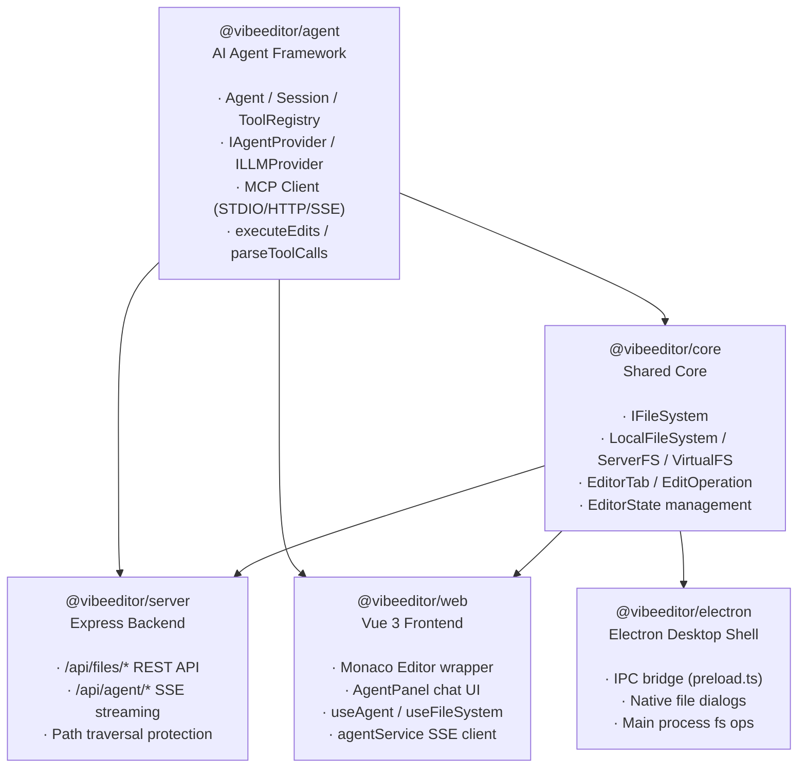
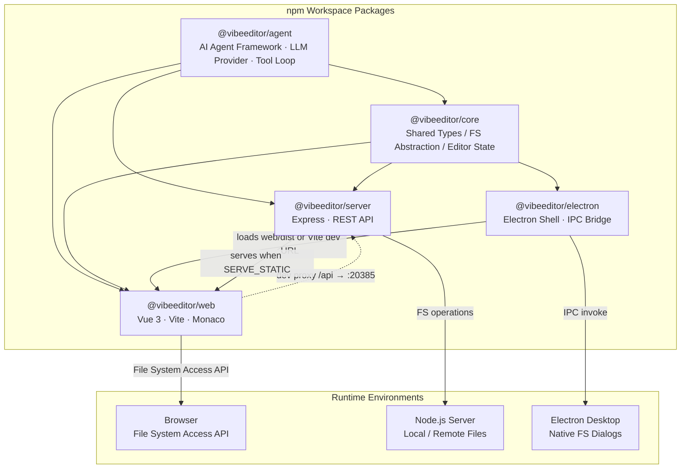
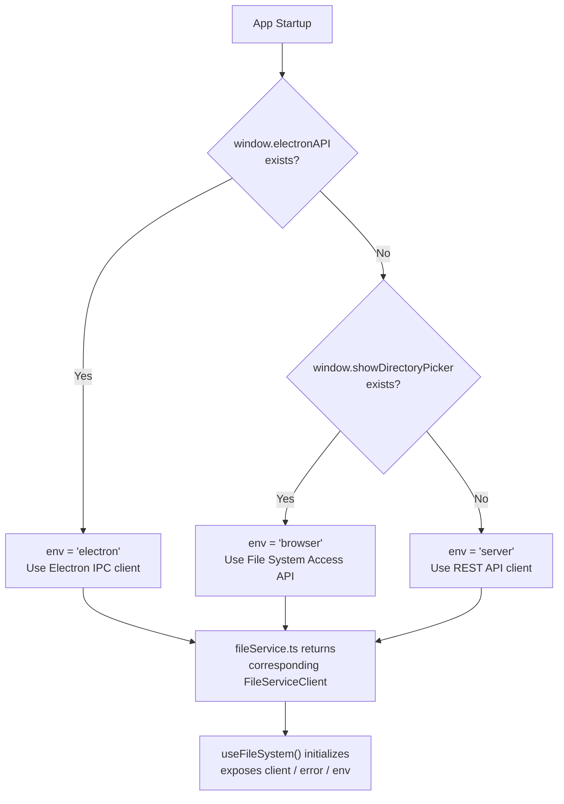
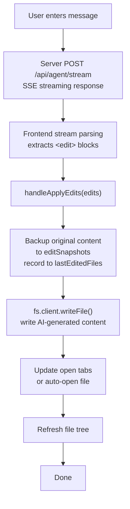
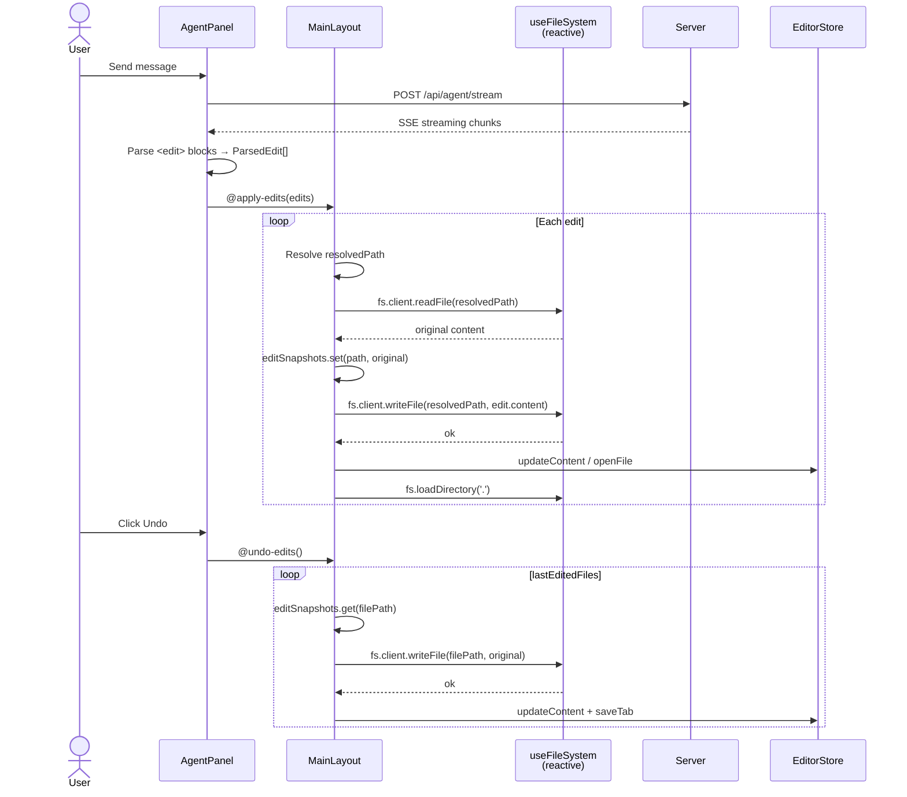

# VibeEditor

> [中文](README.md)

AI-powered code editor built with **Monaco Editor** + **Vue 3**, supporting both **server deployment** and **Electron desktop**.


## Features & Development Status

> **Legend**: ✅ Done &nbsp; ⚠️ Framework ready, needs implementation &nbsp; ❌ Not started

### P0 — Core Editing

| # | Feature | Status | Notes |
|---|---------|--------|-------|
| 1 | Monaco Editor integration | ✅ | Syntax highlighting, vs-dark theme, minimap, bracket pair colorization |
| 2 | Multi-tab management / dirty flag | ✅ | Pinia store driven, `packages/web/src/stores/editor.ts` |
| 3 | Open file (local / remote) | ✅ | Electron IPC + Server API working; browser File System Access API scaffold only |
| 4 | Open folder (file tree) | ✅ | Electron `showOpenDialog` + Server `/api/files/list` working; browser side incomplete |
| 5 | Save file (Ctrl+S) | ✅ | Electron IPC + Server API both implemented |
| 6 | New untitled file | ✅ | `store.newUntitled()` |
| 7 | Keyboard shortcuts | ⚠️ | Copy (Ctrl+C), Paste (Ctrl+V), Cut (Ctrl+X), Undo (Ctrl+Z), Redo (Ctrl+Y), Find (Ctrl+F), Replace (Ctrl+H) bound; Electron menu shortcut IPC bridge ready but unused; full shortcut system missing |

### P1 — AI Agent Assisted Editing

| # | Feature | Status | Notes |
|---|---------|--------|-------|
| 8 | Agent chat panel | ✅ | `AgentPanel.vue`, supports chat/edit/agent modes, Markdown + KaTeX rendering, multi-provider config management |
| 9 | Agent streaming response (SSE) | ✅ | Server SSE + frontend stream parsing fully working with real LLM backend |
| 10 | Agent generates edits and applies to files | ⚠️ | `<edit>` tag parsing → file writing pipeline works end-to-end; `/api/agent/apply-edits` endpoint exists on server but `executor.ts` from `@vibeeditor/agent` not wired to frontend; edit/agent mode system prompt hardcoded to `chat` in `@vibeeditor/agent` `provider.ts` (bug) |
| 11 | Agent context builder (open files + cursor + selection) | ✅ | `@vibeeditor/agent` — `buildContextPrompt()` implemented; frontend `useAgent.ts` does not populate `openFiles`/`fileTree` context in requests |
| 12 | Edit undo / redo | ⚠️ | `@vibeeditor/agent` — `revertEdits()` implemented; not wired to frontend UI |
| 13 | LLM backend integration (OpenAI / Anthropic / etc.) | ⚠️ | OpenAI-compatible API via raw fetch (works with Ollama, vLLM, etc.); no SDK dependencies; edit/agent mode system prompt bug (#10) needs fix |

### P2 — File System & Project Management

| # | Feature | Status | Notes |
|---|---------|--------|-------|
| 14 | Three file system implementations (`IFileSystem`) | ✅ | `LocalFileSystem` / `ServerFileSystem` / `VirtualFileSystem` |
| 15 | Runtime environment auto-detection | ✅ | `fileService.ts` → detect Electron / Server / Browser |
| 16 | File / folder rename | ✅ | Backend API implemented; context menu integrated |
| 17 | File / folder delete | ✅ | Backend API implemented; context menu integrated |
| 18 | New file / folder creation | ✅ | Server + Electron API implemented; integrated into File menu dropdown with Ctrl+N keyboard shortcut |
| 19 | File watching / auto-refresh | ⚠️ | `IFileSystem.watch()` defined, `LocalFileSystem` implemented; server has `chokidar` dependency but push not active; frontend not consuming |
| 20 | Drag and drop files to open | ✅ | `MainLayout.vue` with visual drop overlay; supports both Electron (native paths) and browser (FileSystemDirectoryHandle) |
| 21 | Recent projects / files list | ❌ | |
| 22 | Workspace persistence (remember last opened folder) | ❌ | Pinia store is in-memory only, lost on refresh (only LLM provider configs persist to localStorage) |

### P3 — Editing Enhancements

| # | Feature | Status | Notes |
|---|---------|--------|-------|
| 23 | Find / replace (single file) | ✅ | Custom `SearchPanel.vue` with i18n support, results grouped by file, click to navigate |
| 24 | Cross-file search (project-wide) | ❌ | |
| 25 | Diff view | ❌ | Monaco built-in diff editor, not wrapped |
| 26 | Code folding / outline | ✅ | Supported natively by Monaco |
| 27 | Multi-cursor editing | ✅ | Supported natively by Monaco |
| 28 | Diagnostics / error highlighting | ❌ | Needs TypeScript/ESLint Language Server integration |
| 29 | Code completion / IntelliSense | ⚠️ | Monaco basic completion built-in; TypeScript smart completion not configured |
| 30 | Code snippets | ❌ | |
| 31 | Formatting (Prettier integration) | ❌ | Prettier installed as devDependency but never invoked |
| 32 | Theme switching (light / dark / custom) | ✅ | dark/light/blue theme support, persisted to localStorage, Monaco theme synced |

### P4 — Deployment & Distribution

| # | Feature | Status | Notes |
|---|---------|--------|-------|
| 33 | Server deployment (Express + static frontend) | ✅ | `SERVE_STATIC` env var points to `web/dist` |
| 34 | Electron desktop app | ✅ | Supports dev/prod mode, IPC file operations, file dialogs |
| 35 | Electron native menu bar | ✅ | File/Edit/Help menus with keyboard shortcuts in both `main.ts` and `main-server.ts` |
| 36 | Electron packaging / installer (electron-builder) | ⚠️ | Basic `build` config in `package.json` (appId, productName); missing platform targets (win/mac/linux), icons, auto-update; not verified |
| 37 | Path traversal protection | ✅ | Server file routes enforce `resolve` → `startsWith` check |
| 38 | Authentication (Bearer Token) | ⚠️ | Middleware implemented but never imported or mounted in `index.ts` (dead code) |
| 39 | Docker deployment | ❌ | |
| 40 | CI/CD (GitHub Actions) | ❌ | |

### P5 — UX & Engineering

| # | Feature | Status | Notes |
|---|---------|--------|-------|
| 41 | Resizable layout (draggable splitter) | ✅ | `MainLayout.vue` — adjustable sidebar width |
| 42 | Status bar (cursor position, language, encoding) | ✅ | Custom `StatusBar.vue` showing language, live line/column, workspace mode |
| 43 | Context menus (right-click) | ✅ | File tree context menu via `@imengyu/vue3-context-menu` with rename, delete, new, cut/copy/paste, copy paths |
| 44 | Error / notification toasts | ❌ | `useFileSystem.error` ref exists but never rendered by any UI |
| 45 | Loading states / skeletons | ⚠️ | Text-based "Loading..." indicators exist in FileTree and AgentPanel; no skeletons/animations |
| 46 | Internationalization (i18n) | ✅ | Chinese/English via vue-i18n, persisted to localStorage, covers all UI text |
| 47 | Responsive / mobile adaptation | ❌ | Only `<meta viewport>` tag present; no @media queries |
| 48 | Automated testing (unit / e2e) | ❌ | No test framework configured |
| 49 | ESLint / Prettier config | ❌ | Dependencies installed, no config files (lint command will fail) |
| 50 | Session restore (reopen tabs on restart) | ❌ | Pinia store is in-memory only, lost on refresh |

### Summary

| Status | Count |
|--------|-------|
| ✅ Done | 27 |
| ⚠️ Scaffold ready | 9 |
| ❌ Not started | 14 |
| **Total** | **50** |

## Architecture Docs

### 1. Package Dependencies

> Arrow direction: `A --> B` means B depends on A



**Key changes (vs. old architecture)**:
- **New** `@vibeeditor/agent` — Agent code extracted from `core` and `server` into a standalone agent module with MCP client
- **`@vibeeditor/core` slimmed** — Removed `agent/` directory (types, context, executor), now focuses on file system and editor state
- **`@vibeeditor/server` slimmed** — Removed `agent/` directory (provider, loop), now depends on `@vibeeditor/agent`
- **Zero external dependencies** — `@vibeeditor/agent` depends on no workspace packages, decoupled from platform via `IAgentFileSystem`

### 2. Architecture Diagram — Package Dependencies & Deployment Topology



**Note**: `@vibeeditor/agent` is a standalone AI Agent framework providing LLM Provider, Agent Loop, and tool execution. `@vibeeditor/core` focuses on file system abstraction and editor state management. The `web` frontend proxies `/api` to `server` via Vite in development. In Electron mode, the frontend is loaded by the Electron window, and file operations are bridged to the main process Node.js `fs` through `preload.ts` IPC.

### 3. Flowcharts

#### 3.1 Runtime Environment Detection & File Service Selection



**Note**: `detectEnvironment()` in `fileService.ts:22` detects and caches the runtime environment once. All subsequent file operations go through the unified `FileServiceClient` interface; upper-layer components are unaware of the underlying differences.

#### 3.2 Agent Edit Operation Flow



**Note**: Every agent edit operation automatically backs up the original file content before writing, enabling the user to roll back all changes with a single `undoLastEdits()` call.

### 4. Sequence Diagram — Agent Edit & Undo



**Note**: `handleApplyEdits` snapshots the original content before each write; `undoLastEdits` iterates `lastEditedFiles` to restore each file. `fs` is created via `reactive(useFileSystem())` — Vue 3's `reactive()` auto-unwraps nested `ref`s, so access uses `fs.client` directly, not `fs.client.value`.

### 5. Core Types Overview

**File System Abstraction Layer:**

| Interface / Class | Package | Description |
|----------|--------|------|
| `IAgentFileSystem` | `@vibeeditor/agent` | Minimal file system interface (readFile / writeFile / exists / readDir) |
| `IFileSystem` | `@vibeeditor/core` | Full file system interface (deleteFile / createDir / rename / stat / watch / dispose) |
| `LocalFileSystem` | `@vibeeditor/core` | Node.js `fs/promises` implementation |
| `ServerFileSystem` | `@vibeeditor/core` | REST API client implementation |
| `VirtualFileSystem` | `@vibeeditor/core` | In-memory Map implementation |

**Agent / AI Layer:**

| Interface / Class | Package | Description |
|----------|--------|------|
| `IAgentProvider` | `@vibeeditor/agent` | High-level Agent Provider interface (initialize / sendMessage / streamMessage) |
| `ILLMProvider` | `@vibeeditor/agent` | Low-level LLM call interface (chat / chatStream) |
| `Agent` | `@vibeeditor/agent` | Multi-turn tool-using loop, auto-registers 5 default tools |
| `Session` | `@vibeeditor/agent` | Main + sub-agent orchestration, `<delegate>` routing |
| `ToolRegistry` | `@vibeeditor/agent` | Tool registration, lookup, system prompt generation |
| `ITool` | `@vibeeditor/agent` | Tool interface (name / description / usage / inputSchema / execute) |
| `McpManager` | `@vibeeditor/agent` | Multi-server MCP connection management, tool discovery & routing |

**Editor State:**

| Interface / Class | Package | Description |
|----------|--------|------|
| `EditorTab` | `@vibeeditor/core` | Tab metadata (id / name / path / content / language / isDirty) |
| `EditOperation` | `@vibeeditor/agent` | Edit operation (oldText / newText / filePath) |
| `AgentContext` | `@vibeeditor/agent` | Agent context (openFiles / fileTree / cursorPosition / selection / conversationHistory) |
| `EditorStore` | `@vibeeditor/web` | Pinia store — single source of truth (tabs / fileTree / workspaceRoot) |

## Quick Start

```bash
# Install dependencies
npm install

# Start server + web frontend simultaneously (auto-builds @vibeeditor/agent + @vibeeditor/core)
npm run dev:all

# Or start individually (each auto-builds @vibeeditor/agent + @vibeeditor/core)
npm run dev:server   # Backend on http://localhost:20385
npm run dev:web      # Frontend on http://localhost:5173
npm run dev:electron # Electron desktop (auto-starts Vite frontend + Electron window)

# CLI and MCP test
npm run cli          # Interactive Agent CLI (supports MCP tools)
npm run mcp:test     # MCP integration test (STDIO / HTTP / SSE)
```

## Deployment Modes

| Mode | File System | Command |
|------|------------|---------|
| **Electron** desktop | Local FS via IPC (`Node.js fs`) | `npm run dev:electron` (auto-starts Vite + Electron, auto-builds agent, core & electron)<br/>Two entry points: `main.ts` (standard window) and `main-server.ts` (embedded server + native menus + frameless window) |
| **Server** (remote files) | Server FS via REST API | `npm run dev:server` + `npm run dev:web` |
| **Browser** (local files) | File System Access API | `npm run dev:web` |

The frontend auto-detects the runtime environment and selects the appropriate file service at `packages/web/src/services/fileService.ts`.

## Build

```bash
npm run build:agent     # Build AI Agent framework
npm run build:core      # Build shared core
npm run build:server    # Build Express backend
npm run build:web       # Build Vue frontend (to packages/web/dist/)
npm run build:electron  # Build Electron main process
npm run build:all       # Build everything (agent → core → web → server → electron)
```

## Server API

| Method | Endpoint | Description |
|--------|----------|-------------|
| GET | `/api/files/list?path=&root=` | List directory contents |
| GET | `/api/files/read?path=&root=` | Read file content |
| GET | `/api/files/read-buffer?path=&root=` | Read file as base64 (binary) |
| POST | `/api/files/write` | Write file `{ path, content, root }` |
| DELETE | `/api/files/delete?path=&root=` | Delete file |
| POST | `/api/files/mkdir` | Create directory `{ path, root }` |
| DELETE | `/api/files/rmdir?path=&root=` | Remove directory |
| GET | `/api/files/exists?path=&root=` | Check path exists |
| GET | `/api/files/stat?path=&root=` | Get file/dir metadata |
| POST | `/api/files/rename` | Rename `{ oldPath, newPath, root }` |
| POST | `/api/agent/chat` | Send message to agent |
| POST | `/api/agent/stream` | Stream agent response (SSE) |
| POST | `/api/agent/apply-edits` | Apply AI-generated edits to files |
| POST | `/api/mcp/test` | Test MCP server connection `{ config }` |
| GET | `/api/config/:filename` | Read config file from `configDir` |
| PUT | `/api/config/:filename` | Write config file to `configDir` |
| GET | `/api/health` | Health check |

## MCP (Model Context Protocol) Support

VibeEditor includes a full MCP client for integrating external tools via the standard protocol.

**Transport Modes:**

| Mode | Use Case |
|------|----------|
| **STDIO** | Local MCP servers (spawned as child processes) |
| **HTTP** | Remote MCP servers (HTTP POST, stateless) |
| **SSE** | Remote MCP servers (Server-Sent Events, auto-extracts `Mcp-Session-Id`) |

**Key Classes:**
- `McpManager` — Multi-server lifecycle: connect, discover tools, auto-route calls
- `MCPClient` — Single-server connection (initialize → `tools/list` → `tools/call`)
- `MCPToolAdapter` — Bridges MCP `tools/call` to the `ITool` interface with auto type coercion
- `ToolCatalog` — Read-only flat tool metadata store for display/CLI

**Usage (multi-server):**
```ts
const manager = new McpManager();
await manager.connectAll({
  mcpServers: {
    filesystem: { type: 'stdio', command: 'npx', args: ['-y', '@anthropic/mcp-server-filesystem'] },
    remote: { type: 'sse', url: 'https://example.com/mcp', headers: { Authorization: 'Bearer xxx' } },
  },
});
const tools = await manager.discoverAndCreateAdapters();
tools.forEach(t => agent.registerTool(t));
```

**Integration Points:**
- Server SSE endpoint (`routes/agent.ts`) reads `mcpConfig` from request body, connects servers, registers MCP tools on the Agent
- CLI (`cli.ts`) supports interactive MCP tools
- Frontend `McpSettingsPanel.vue` manages MCP server configurations
- `npm run mcp:test` runs integration tests across all three transports

## Environment Variables

| Variable | Used by | Purpose | Default |
|------|--------|------|--------|
| `LLM_API_URL` | `openai-client.ts` | LLM provider API URL | `https://api.openai.com/v1` |
| `LLM_API_KEY` | `openai-client.ts` | LLM provider API key | (empty) |
| `LLM_MODEL` | `openai-client.ts` | LLM model name | `gpt-4o` |
| `SERVER_PORT` / `PORT` | `server/run.ts`, `electron/main-server.ts` | Server port | `20385` (`app-config.json`) |
| `SERVE_STATIC` | `server/run.ts` | Static frontend path (production) | (empty) |
| `VITE_DEV_SERVER_URL` | `electron/main.ts`, `electron/main-server.ts` | Vite dev server URL | `http://localhost:5173` |
| `AUTH_TOKEN` | `middleware/auth.ts` | Bearer token (middleware not mounted) | (empty) |
| `ELECTRON_MIRROR` | npm install | China mirror for Electron binary downloads | (empty) |

Priority: explicit params > environment variables > defaults

## Project Structure

### `@vibeeditor/agent`
- `types/agent.ts` — `AgentConfig`, `AgentContext`, `AgentDefinition`, `AgentMode`, `AgentResult`, `SessionMessage`
- `types/edit.ts` — `EditOperation`, `EditResult`
- `types/filesystem.ts` — `IAgentFileSystem` (minimal: readFile / writeFile / exists / readDir)
- `types/message.ts` — `AgentMessage`
- `types/provider.ts` — `IAgentProvider` (high-level), `ILLMProvider` (low-level raw LLM)
- `types/tool.ts` — `ITool`, `ToolInputSchema`, `ToolExecutionContext`, `ToolAnnotations`
- `agent.ts` — `Agent` class: multi-turn tool-using loop, auto-registers 5 default tools
- `session.ts` — `Session` class: main + sub-agent orchestration, `<delegate>` tag routing
- `tool-registry.ts` — `ToolRegistry`: register, lookup, system prompt generation
- `tools/read-file.ts` — `ReadFileTool` (`<read_file>`)
- `tools/list-dir.ts` — `ListDirTool` (`<list_dir>`)
- `tools/search-code.ts` — `SearchCodeTool` (`<search_code>`)
- `tools/bash.ts` — `BashTool` (`<bash>`) — execute shell commands
- `tools/delegate.ts` — `DelegateTool` (`<delegate>`)
- `tools/index.ts` — `createDefaultTools()` factory (5 tools)
- `mcp/manager.ts` — `McpManager`: multi-server lifecycle, transport factory, tool routing
- `mcp/client.ts` — `MCPClient`: single-server connection (initialize / listTools / callTool)
- `mcp/adapter.ts` — `MCPToolAdapter`: bridges MCP `tools/call` to `ITool`
- `mcp/config.ts` — `McpConfig` / `McpServerConfig` type definitions
- `mcp/tool-catalog.ts` — `ToolCatalog`: read-only flat tool metadata store
- `mcp/utils.ts` — `formatMCPResult`, `buildXMLUsage` helpers
- `mcp/__test.ts` — MCP integration test (STDIO / HTTP / SSE transports)
- `provider.ts` — `OpenAILikeProvider` (implements `IAgentProvider`, native fetch, no SDK)
- `openai-client.ts` — `createOpenAILLMProvider()` factory (implements `ILLMProvider`), `resolveLLMConfig()`, `buildMessages()`
- `loop.ts` — `AgentLoop` (@deprecated, use `Agent` + `Session` instead)
- `parser.ts` — `parseToolCalls()`: regex-based XML tag extraction from LLM responses
- `executor.ts` — `executeEdits()` / `revertEdits()`: AI-generated file modification
- `context.ts` — `buildContextPrompt()`, `createEmptyContext()`, `getConversationSummary()`
- `cli.ts` — Interactive CLI agent with MCP tool support
- `index.ts` — Re-exports all public API

### `@vibeeditor/core`
- `fs/types.ts` — `IFileSystem` interface, `FileEntry`, `FileContent`
- `fs/local.ts` — `LocalFileSystem` (Node.js fs)
- `fs/server.ts` — `ServerFileSystem` (REST client)
- `fs/virtual.ts` — `VirtualFileSystem` (in-memory)
- `editor/types.ts` — `EditorTab`, `EditOperation`, language detection
- `editor/document.ts` — Tab/document state management

### `@vibeeditor/web`
- `components/editor/MonacoEditor.vue` — Monaco editor wrapper (theme-aware)
- `components/editor/ImageViewer.vue` — PNG / JPG / GIF / SVG / WebP viewer
- `components/editor/PdfViewer.vue` — PDF rendering
- `components/editor/DocxViewer.vue` — Word document viewer
- `components/editor/ExcelViewer.vue` — Excel spreadsheet viewer
- `components/editor/PptxViewer.vue` — PowerPoint slides viewer
- `components/editor/MarkdownViewer.vue` — Markdown rendering with KaTeX math
- `components/editor/HtmlViewer.vue` — HTML live preview
- `components/agent/AgentPanel.vue` — AI chat panel (messages, streaming, tool status)
- `components/agent/ModeSelector.vue` — build/plan mode toggle
- `components/agent/ProviderSelect.vue` — LLM provider selection dropdown
- `components/agent/SettingsDialog.vue` — Provider config (API URL, key, model)
- `components/file-tree/FileTree.vue` — Directory tree component
- `components/file-tree/TreeNode.vue` — Recursive tree node
- `components/file-tree/contextMenu.ts` — Context menu builder (open/rename/delete/new/cut/copy/paste/copy paths)
- `components/layout/MainLayout.vue` — Resizable split layout
- `components/layout/ActivityBar.vue` — Left icon bar
- `components/layout/SideBar.vue` — Side panel container
- `components/layout/RightToolbar.vue` — Right toolbar (agent/MCP toggle)
- `components/layout/AboutDialog.vue` — About dialog
- `components/mcp/McpSettingsPanel.vue` — MCP server list management
- `components/mcp/McpServerItem.vue` — MCP server row (name, type, toggle)
- `components/mcp/McpEditDialog.vue` — Add/edit MCP server dialog
- `components/mcp/McpToolList.vue` — Tool list display
- `components/settings/SettingDropdown.vue` — Theme/language popover
- `components/toolbar/Toolbar.vue` — Top toolbar
- `components/SearchPanel.vue` — Search panel (i18n, results grouped by file)
- `components/SaveDialog.vue` — Save confirmation dialog
- `components/StatusBar.vue` — Status bar (language, line/column, workspace mode)
- `composables/useAgent.ts` — Agent state, streaming, context assembly
- `composables/useFileSystem.ts` — File operations + keyboard shortcuts
- `composables/useEditor.ts` — Monaco instance management, file opening
- `composables/useProviderSettings.ts` — LLM provider config persistence
- `composables/useMcpSettings.ts` — MCP server list persistence
- `composables/useFileClipboard.ts` — File cut/copy/paste operations
- `composables/useFileTreeContextMenu.ts` — Context menu integration
- `composables/useWindowResize.ts` — Frameless window resize handles
- `services/agentService.ts` — Agent REST/SSE client
- `services/fileService.ts` — Runtime detection + 3-mode file operations
- `services/configService.ts` — Config CRUD (Electron IPC / REST / localStorage)
- `services/mcpService.ts` — MCP server connection testing
- `services/editParser.ts` — Re-exports `parseEditsFromText`
- `services/editorInstance.ts` — Monaco editor singleton holder
- `services/markdown.ts` — Markdown rendering with KaTeX
- `stores/editor.ts` — Pinia: tabs, file tree, workspace
- `stores/settings.ts` — Pinia: language + theme (dark/light/blue)
- `stores/sessions.ts` — Pinia: multi-session agent chat management
- `locales/en.ts` — English translations
- `locales/zh.ts` — Chinese translations
- `locales/index.ts` — vue-i18n setup

### `@vibeeditor/server`
- `routes/files.ts` — File CRUD API (list/read/read-buffer/write/delete/mkdir/rmdir/exists/stat/rename) with path traversal protection
- `routes/agent.ts` — Agent chat + SSE streaming endpoints (MCP-integrated in build mode)
- `routes/mcp.ts` — `POST /test` MCP server connection testing
- `routes/config.ts` — `GET/PUT /:filename` config file management
- `middleware/auth.ts` — Bearer token authentication (not mounted by default)
- `index.ts` — Express app factory + `startServer()`
- `run.ts` — CLI entry point (reads app-config.json, starts server)

### `@vibeeditor/electron`
- `main.ts` — Standard Electron entry: creates `BrowserWindow`, loads Vite dev URL or `web/dist/index.html`, native menu bar
- `main-server.ts` — Embedded Express server entry: native menu bar, frameless window, `vibe://` protocol, single-instance lock
- `preload.ts` — Context bridge exposing `window.electronAPI` (23 IPC channels)
- `ipc/file-handler.ts` — Native file dialogs and FS operations

---

> For contributor guidance, see [CLAUDE.md](CLAUDE.md) — complete script reference, architecture design, component data flow, and development conventions.