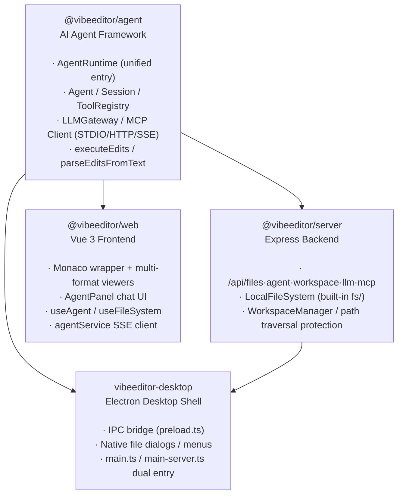
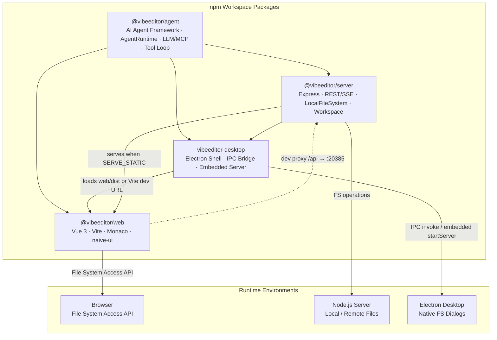
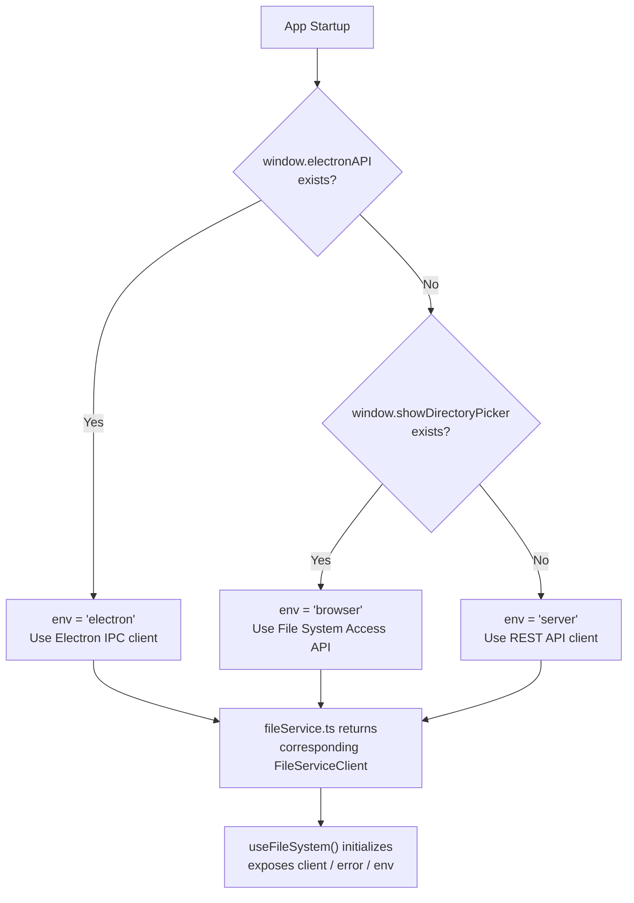
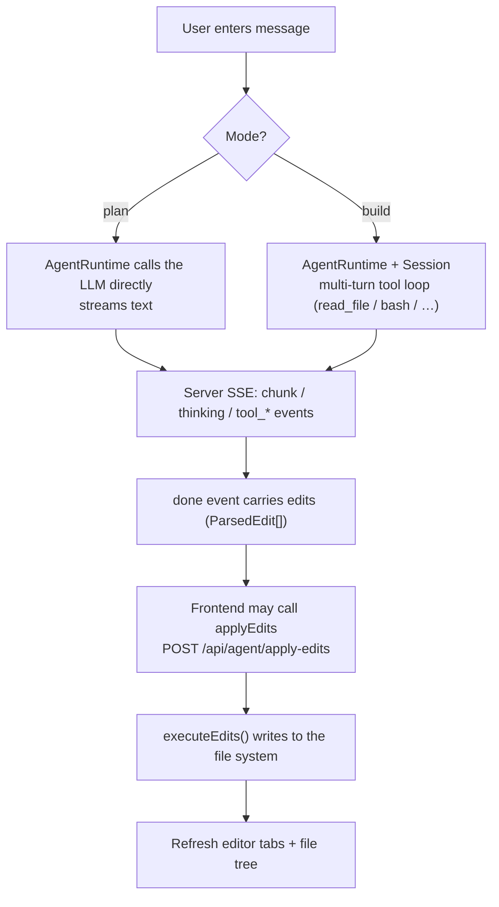
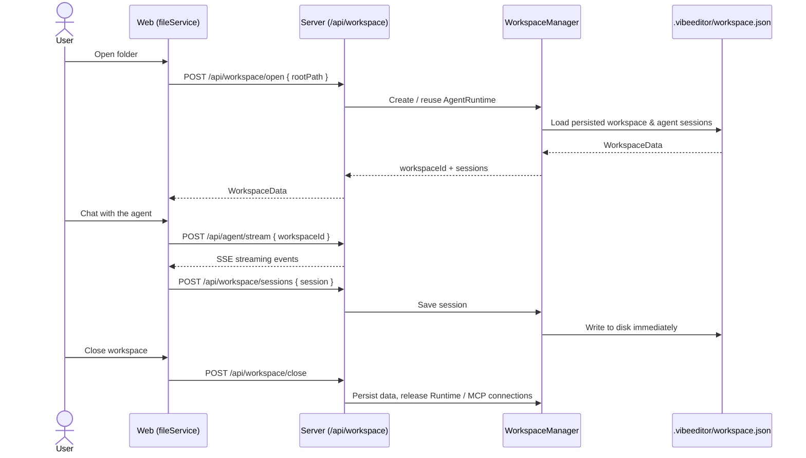

# VibeEditor

> [中文](README.md)

AI-powered code editor built with **Monaco Editor** + **Vue 3**, supporting both **server deployment** and **Electron desktop**.


## Quick Start · Build & Deploy

### Install

```bash
npm install
```

### Develop

There are only **two** dev modes:

| Mode | Command | Notes |
|------|---------|-------|
| **Server (separated frontend/backend)** | `npm run dev:all` | Starts the Express backend (`http://localhost:20385`) and the Vite frontend (`http://localhost:5173`) together; they talk over the `/api` proxy. Suited to browser / remote deployment |
| **Electron desktop** | `npm run dev:electron` | Starts the Vite frontend + an Electron window; local files are read/written via main-process IPC (`main.ts` entry) |

> Both commands auto-build `@vibeeditor/agent` first.

To **test the agent module on its own** (without launching the editor UI), use the interactive CLI:

```bash
npm run cli          # Interactive Agent CLI (supports MCP tools)
```

### Build

```bash
npm run build:all       # Build everything (agent → web → server → electron)

# Or build individually
npm run build:agent     # AI Agent framework
npm run build:server    # Express backend
npm run build:web       # Vue frontend (output to packages/web/dist/)
npm run build:electron  # Electron main process
```

### Deploy

| Target | Command | Notes |
|--------|---------|-------|
| **Server deployment** | `npm run build:all` + `SERVE_STATIC` | After building, start the server with `SERVE_STATIC` pointing to `packages/web/dist` so Express serves both the frontend and the API |
| **Electron unpacked dir** | `npm run pack:electron` | electron-builder `--dir` mode: produces the unpacked app directory only, **no installer** — for verifying the package locally |
| **Electron installer** | `npm run dist:electron` | Full electron-builder packaging: produces a distributable **Windows NSIS installer** |

> Electron has two main-process entries: `main.ts` (standard window, IPC file operations) and `main-server.ts` (embedded Express server) — see [packages/electron/README.md](packages/electron/README.md). The frontend auto-detects the runtime environment (Electron / Server / Browser) and selects the appropriate file service at `packages/web/src/services/fileService.ts`.

## Features & Development Status

> **Legend**: ✅ Done &nbsp; ⚠️ Framework ready, needs implementation &nbsp; ❌ Not started

### P0 — Core Editing

| # | Feature | Status | Notes |
|---|---------|--------|-------|
| 1 | Monaco Editor integration | ✅ | Syntax highlighting, vs-dark theme, minimap, bracket pair colorization |
| 2 | Multi-tab management / dirty flag | ✅ | Pinia store driven, `packages/web/src/stores/editor.ts` |
| 3 | Open file (local / remote) | ✅ | Electron IPC + Server API working; browser File System Access API scaffold only |
| 4 | Open folder (file tree) | ✅ | Electron `showOpenDialog` + Server `/api/files/list` working; browser side incomplete |
| 5 | Save file (Ctrl+S) | ✅ | Electron IPC + Server API both implemented |
| 6 | New untitled file | ✅ | `store.newUntitled()` |
| 7 | Keyboard shortcuts | ⚠️ | Copy (Ctrl+C), Paste (Ctrl+V), Cut (Ctrl+X), Undo (Ctrl+Z), Redo (Ctrl+Y), Find (Ctrl+F), Replace (Ctrl+H) bound; Electron menu shortcut IPC bridge ready but unused; full shortcut system missing |

### P1 — AI Agent Assisted Editing

| # | Feature | Status | Notes |
|---|---------|--------|-------|
| 8 | Agent chat panel | ✅ | `AgentPanel.vue`, supports chat/edit/agent modes, Markdown + KaTeX rendering, multi-provider config management |
| 9 | Agent streaming response (SSE) | ✅ | Server SSE + frontend stream parsing fully working with real LLM backend |
| 10 | Agent generates edits and applies to files | ⚠️ | `<edit>` tag parsing → file writing pipeline works end-to-end; `/api/agent/apply-edits` endpoint exists on server but `executor.ts` from `@vibeeditor/agent` not wired to frontend; edit/agent mode system prompt hardcoded to `chat` in `@vibeeditor/agent` `provider.ts` (bug) |
| 11 | Agent context builder (open files + cursor + selection) | ✅ | `@vibeeditor/agent` — `buildContextPrompt()` implemented; frontend `useAgent.ts` does not populate `openFiles`/`fileTree` context in requests |
| 12 | Edit undo / redo | ⚠️ | `@vibeeditor/agent` — `revertEdits()` implemented; not wired to frontend UI |
| 13 | LLM backend integration (OpenAI / Anthropic / etc.) | ⚠️ | OpenAI-compatible API via raw fetch (works with Ollama, vLLM, etc.); no SDK dependencies; edit/agent mode system prompt bug (#10) needs fix |

### P2 — File System & Project Management

| # | Feature | Status | Notes |
|---|---------|--------|-------|
| 14 | Three file system implementations | ✅ | `LocalFileSystem` (server `fs/`) + browser FSA client + REST client (web `fileService.ts`) |
| 15 | Runtime environment auto-detection | ✅ | `fileService.ts` → detect Electron / Server / Browser |
| 16 | File / folder rename | ✅ | Backend API implemented; context menu integrated |
| 17 | File / folder delete | ✅ | Backend API implemented; context menu integrated |
| 18 | New file / folder creation | ✅ | Server + Electron API implemented; integrated into File menu dropdown with Ctrl+N keyboard shortcut |
| 19 | File watching / auto-refresh | ⚠️ | `IFileSystem.watch()` defined, `LocalFileSystem` implemented; server has `chokidar` dependency but push not active; frontend not consuming |
| 20 | Drag and drop files to open | ✅ | `MainLayout.vue` with visual drop overlay; supports both Electron (native paths) and browser (FileSystemDirectoryHandle) |
| 21 | Recent projects / files list | ❌ | |
| 22 | Workspace persistence (remember last opened folder) | ❌ | Pinia store is in-memory only, lost on refresh (only LLM provider configs persist to localStorage) |

### P3 — Editing Enhancements

| # | Feature | Status | Notes |
|---|---------|--------|-------|
| 23 | Find / replace (single file) | ✅ | Custom `SearchPanel.vue` with i18n support, results grouped by file, click to navigate |
| 24 | Cross-file search (project-wide) | ❌ | |
| 25 | Diff view | ❌ | Monaco built-in diff editor, not wrapped |
| 26 | Code folding / outline | ✅ | Supported natively by Monaco |
| 27 | Multi-cursor editing | ✅ | Supported natively by Monaco |
| 28 | Diagnostics / error highlighting | ❌ | Needs TypeScript/ESLint Language Server integration |
| 29 | Code completion / IntelliSense | ⚠️ | Monaco basic completion built-in; TypeScript smart completion not configured |
| 30 | Code snippets | ❌ | |
| 31 | Formatting (Prettier integration) | ❌ | Prettier installed as devDependency but never invoked |
| 32 | Theme switching (light / dark / custom) | ✅ | dark/light/blue theme support, persisted to localStorage, Monaco theme synced |

### P4 — Deployment & Distribution

| # | Feature | Status | Notes |
|---|---------|--------|-------|
| 33 | Server deployment (Express + static frontend) | ✅ | `SERVE_STATIC` env var points to `web/dist` |
| 34 | Electron desktop app | ✅ | Supports dev/prod mode, IPC file operations, file dialogs |
| 35 | Electron native menu bar | ✅ | File/Edit/Help menus with keyboard shortcuts in both `main.ts` and `main-server.ts` |
| 36 | Electron packaging / installer (electron-builder) | ⚠️ | Basic `build` config in `package.json` (appId, productName); missing platform targets (win/mac/linux), icons, auto-update; not verified |
| 37 | Path traversal protection | ✅ | Server file routes enforce `resolve` → `startsWith` check |
| 38 | Authentication (Bearer Token) | ⚠️ | Middleware implemented but never imported or mounted in `index.ts` (dead code) |
| 39 | Docker deployment | ❌ | |
| 40 | CI/CD (GitHub Actions) | ❌ | |

### P5 — UX & Engineering

| # | Feature | Status | Notes |
|---|---------|--------|-------|
| 41 | Resizable layout (draggable splitter) | ✅ | `MainLayout.vue` — adjustable sidebar width |
| 42 | Status bar (cursor position, language, encoding) | ✅ | Custom `StatusBar.vue` showing language, live line/column, workspace mode |
| 43 | Context menus (right-click) | ✅ | File tree context menu via `@imengyu/vue3-context-menu` with rename, delete, new, cut/copy/paste, copy paths |
| 44 | Error / notification toasts | ❌ | `useFileSystem.error` ref exists but never rendered by any UI |
| 45 | Loading states / skeletons | ⚠️ | Text-based "Loading..." indicators exist in FileTree and AgentPanel; no skeletons/animations |
| 46 | Internationalization (i18n) | ✅ | Chinese/English via vue-i18n, persisted to localStorage, covers all UI text |
| 47 | Responsive / mobile adaptation | ❌ | Only `<meta viewport>` tag present; no @media queries |
| 48 | Automated testing (unit / e2e) | ❌ | No test framework configured |
| 49 | ESLint / Prettier config | ❌ | Dependencies installed, no config files (lint command will fail) |
| 50 | Session restore (reopen tabs on restart) | ❌ | Pinia store is in-memory only, lost on refresh |

### Summary

| Status | Count |
|--------|-------|
| ✅ Done | 27 |
| ⚠️ Scaffold ready | 9 |
| ❌ Not started | 14 |
| **Total** | **50** |

## Architecture Docs

### 1. Package Dependencies

> Arrow direction: `A --> B` means B depends on A



> The repo currently has **4 workspace packages** (`agent` / `server` / `web` / `electron`); there is no `@vibeeditor/core`.

**Architecture highlights**:
- **`@vibeeditor/agent`** is the core module, exposing `AgentRuntime` as its unified entry; it depends on no workspace package and is decoupled from the platform via `IAgentFileSystem`
- **File-system implementations live with their consumers**: `LocalFileSystem`/`FileEntry` live in `@vibeeditor/server`'s `fs/`; the browser FSA client and REST client live in `@vibeeditor/web`'s `fileService.ts`; the editor tab type (`EditorTab`) lives in `@vibeeditor/web`'s Pinia store
- **`@vibeeditor/server`** depends on `@vibeeditor/agent` and provides the full file / agent / workspace / LLM / MCP REST·SSE API
- **`vibeeditor-desktop`** (Electron) can embed `@vibeeditor/server` (`main-server.ts`) or use IPC-only file operations (`main.ts`)

### 2. Architecture Diagram — Package Dependencies & Deployment Topology



**Note**: `@vibeeditor/agent` is a standalone AI Agent framework whose unified entry is `AgentRuntime`, providing LLM provider management, the multi-turn tool loop, the MCP client, and edit execution. `@vibeeditor/server` depends on agent and ships its own `LocalFileSystem` (`fs/`) and workspace management. The `web` frontend proxies `/api` to `server` via Vite in development. In Electron mode, the frontend is loaded by the Electron window, and file operations are bridged to the main process via `preload.ts` IPC, or served by the Express server embedded in `main-server.ts`.

### 3. Flowcharts

#### 3.1 Runtime Environment Detection & File Service Selection



**Note**: `detectEnvironment()` in `fileService.ts` detects and caches the runtime environment once, in the order `electron → browser → server`. All subsequent file operations go through the unified `FileServiceClient` interface; upper-layer components are unaware of the underlying differences.

#### 3.2 Agent Conversation & Edit Flow



**Note**: All agent logic runs inside `AgentRuntime` in `@vibeeditor/agent` (the instance lives on the server). `plan` mode streams the LLM directly; `build` mode runs the multi-turn tool loop. The final `done` event carries the `<edit>` blocks parsed from the reply; edits are written via `executeEdits()`.

### 4. Sequence Diagram — Workspace Open & Agent Session Persistence



**Note**: The server reuses an `AgentRuntime` (including its MCP connections) by `workspaceId`. Agent conversation history is persisted alongside workspace data in `.vibeeditor/workspace.json` under the workspace directory, so reopening restores tabs and sessions.

### 5. Core Types Overview

**File System Abstraction Layer:**

| Interface / Class | Package | Description |
|----------|--------|------|
| `IAgentFileSystem` | `@vibeeditor/agent` | Minimal file system interface (readFile / writeFile / exists / readDir) |
| `IFileSystem` / `LocalFileSystem` | `@vibeeditor/server` | Server file-system interface and Node.js `fs/promises` implementation (`fs/`) |
| `FileServiceClient` | `@vibeeditor/web` | Unified frontend file client (Electron IPC / Server REST / Browser FSA implementations) |

**Agent / AI Layer (all in `@vibeeditor/agent`):**

| Interface / Class | Description |
|----------|------|
| `AgentRuntime` | **Unified entry**: plan/build modes, session management, MCP integration, edit application |
| `Agent` | Single-agent multi-turn tool-using loop |
| `Session` | Main + sub-agent orchestration, `<delegate>` routing, streaming |
| `ToolRegistry` / `ITool` | Tool registry and tool interface (5 default tools) |
| `McpManager` | Multi-server MCP connection management, tool discovery & routing |
| `LLMGateway` | LLM provider configuration management and persistence |

**Edits & Editor State:**

| Interface / Class | Package | Description |
|----------|--------|------|
| `AgentContext` | `@vibeeditor/agent` | Agent context (openFiles / fileTree / cursorPosition, etc.) |
| `ParsedEdit` / `AgentEditResult` | `@vibeeditor/agent` | Parsed edit block / edit result to apply |
| `EditorTab` / `ViewMode` | `@vibeeditor/web` | Tab (with `viewMode` renderer selection, defined in `stores/editor.ts`) |
| `EditorStore` | `@vibeeditor/web` | Pinia store — single source of truth (tabs / fileTree / workspace) |

## Server API

| Method | Endpoint | Description |
|--------|----------|-------------|
| GET | `/api/files/list?path=&root=` | List directory contents |
| GET | `/api/files/read?path=&root=` | Read file content |
| GET | `/api/files/read-buffer?path=&root=` | Read file as base64 (binary) |
| POST | `/api/files/write` | Write file `{ path, content, root }` |
| DELETE | `/api/files/delete?path=&root=` | Delete file |
| POST | `/api/files/mkdir` | Create directory `{ path, root }` |
| DELETE | `/api/files/rmdir?path=&root=` | Remove directory |
| GET | `/api/files/exists?path=&root=` | Check path exists |
| GET | `/api/files/stat?path=&root=` | Get file/dir metadata |
| POST | `/api/files/rename` | Rename `{ oldPath, newPath, root }` |
| POST | `/api/agent/chat` | Send message to agent |
| POST | `/api/agent/stream` | Stream agent response (SSE) |
| POST | `/api/agent/apply-edits` | Apply AI-generated edits to files |
| GET/POST | `/api/workspace/open·info·update·close` | Workspace lifecycle |
| GET/POST/DELETE | `/api/workspace/sessions` | Agent session persistence (create/delete/list) |
| GET | `/api/workspace/roots·browse` | List system roots / browse the file system |
| GET/POST/PUT/DELETE | `/api/llm/providers` | LLM provider CRUD + set-active + connectivity test |
| GET/POST/PUT/DELETE | `/api/mcp/servers` | MCP server CRUD + `/test` + `/tools` |
| GET | `/api/config/:filename` | Read config file from `configDir` |
| PUT | `/api/config/:filename` | Write config file to `configDir` |
| GET | `/api/health` | Health check |

> See [`packages/server/README.md`](packages/server/README.md) for full request/response fields and examples.

## MCP (Model Context Protocol) Support

VibeEditor includes a full MCP client for integrating external tools via the standard protocol.

**Transport Modes:**

| Mode | Use Case |
|------|----------|
| **STDIO** | Local MCP servers (spawned as child processes) |
| **HTTP** | Remote MCP servers (HTTP POST, stateless) |
| **SSE** | Remote MCP servers (Server-Sent Events, auto-extracts `Mcp-Session-Id`) |

**Key Classes:**
- `McpManager` — Multi-server lifecycle: connect, discover tools, auto-route calls
- `MCPClient` — Single-server connection (initialize → `tools/list` → `tools/call`)
- `MCPToolAdapter` — Bridges MCP `tools/call` to the `ITool` interface with auto type coercion
- `ToolCatalog` — Read-only flat tool metadata store for display/CLI

**Usage (multi-server):**
```ts
const manager = new McpManager();
await manager.connectAll({
  mcpServers: {
    filesystem: { type: 'stdio', command: 'npx', args: ['-y', '@anthropic/mcp-server-filesystem'] },
    remote: { type: 'sse', url: 'https://example.com/mcp', headers: { Authorization: 'Bearer xxx' } },
  },
});
const tools = await manager.discoverAndCreateAdapters();
tools.forEach(t => agent.registerTool(t));
```

**Integration Points:**
- Server SSE endpoint (`routes/agent.ts`) reads `mcpConfig` from request body, connects servers, registers MCP tools on the Agent
- CLI (`cli.ts`) supports interactive MCP tools
- Frontend `McpSettingsPanel.vue` manages MCP server configurations
- `npm run mcp:test` runs integration tests across all three transports

## Environment Variables

| Variable | Used by | Purpose | Default |
|------|--------|------|--------|
| `LLM_API_URL` | `openai-client.ts` | LLM provider API URL | `https://api.openai.com/v1` |
| `LLM_API_KEY` | `openai-client.ts` | LLM provider API key | (empty) |
| `LLM_MODEL` | `openai-client.ts` | LLM model name | `gpt-4o` |
| `SERVER_PORT` / `PORT` | `server/run.ts`, `electron/main-server.ts` | Server port | `20385` (`app-config.json`) |
| `SERVE_STATIC` | `server/run.ts` | Static frontend path (production) | (empty) |
| `VITE_DEV_SERVER_URL` | `electron/main.ts`, `electron/main-server.ts` | Vite dev server URL | `http://localhost:5173` |
| `AUTH_TOKEN` | `middleware/auth.ts` | Bearer token (middleware not mounted) | (empty) |
| `ELECTRON_MIRROR` | npm install | China mirror for Electron binary downloads | (empty) |

Priority: explicit params > environment variables > defaults

## Project Structure

The repo is an npm workspace with **4 packages** (each has its own README; the table below is an overview):

| Package | Role | Key contents | Detailed docs |
|---------|------|--------------|---------------|
| `@vibeeditor/agent` | AI Agent framework | `AgentRuntime` (unified entry), `Agent`/`Session`, 5 default tools, `McpManager`, `LLMGateway`, `executeEdits`/`parseEditsFromText`, structured logging, CLI | [packages/agent/README.md](packages/agent/README.md) |
| `@vibeeditor/server` | Express backend | `createApp`/`startServer`, `fs/` (`LocalFileSystem`), `routes/` (files·agent·workspace·llm·mcp·config), `WorkspaceManager`, request-logging middleware | [packages/server/README.md](packages/server/README.md) |
| `@vibeeditor/web` | Vue 3 frontend | `MonacoEditor` + multi-format viewers, `AgentPanel`, file tree, MCP/settings panels, `composables/`, `services/` (`fileService`, etc.), `stores/` (editor/sessions/settings), i18n | [packages/web/README.md](packages/web/README.md) |
| `vibeeditor-desktop` | Electron desktop shell | `main.ts`/`main-server.ts` dual entry, `preload.ts` (`window.electronAPI`), `ipc/file-handler.ts`, native menus, `vibe://` protocol | [packages/electron/README.md](packages/electron/README.md) |

> Note: the `@vibeeditor/core` package referenced in earlier docs no longer exists — its file-system implementations (`LocalFileSystem`/`FileEntry`) were folded into `@vibeeditor/server`'s `fs/`, and the editor tab type into `@vibeeditor/web`'s Pinia store.

---

> For contributor guidance, see [CLAUDE.md](CLAUDE.md) — complete script reference, architecture design, component data flow, and development conventions.